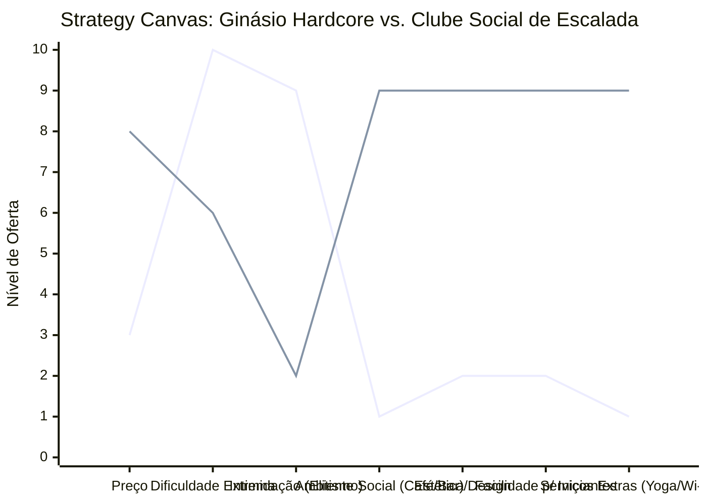

# Estudo de Caso Blue Ocean: Academia de Escalada
## Do "Ginásio de Suor" ao "Clube Social Vertical"

### 1. O Cenário Atual (Oceano Vermelho)

O mercado de academias de escalada ("ginásios") tradicionalmente atende a um nicho muito específico: o escalador hardcore ("dirtbag").

1.  **Academias "Old School":** Focadas apenas no treino físico intenso, ambientes escuros, sujos de magnésio, rotas extremamente difíceis e uma cultura intimidante para iniciantes.
2.  **Academias de Musculação Genéricas:** Paredes de escalada pequenas e mal cuidadas como um "adicional", sem instrutores qualificados.

A competição é por quem tem a via mais difícil ou o preço mais baixo de mensalidade.

### 2. A Estratégia do Oceano Azul: "O Terceiro Lugar"

A nova geração de academias de escalada se posiciona não apenas como um local de treino, mas como um **Centro de Estilo de Vida e Comunidade**. O foco muda da performance atlética pura para a socialização e o bem-estar.

**A Nova Proposta de Valor:**
*   **Foco:** Jovens profissionais, iniciantes curiosos e grupos de amigos.
*   **Ambiente:** Limpo, iluminado, com design moderno, café/bar integrado e espaços de co-working.
*   **Experiência:** Escalada acessível (Boulder), aulas de yoga complementares, eventos sociais noturnos.

### 3. Strategy Canvas (Tela Estratégica)

O gráfico compara o ginásio tradicional com o novo conceito de "Clube de Escalada".

**Legenda:**
*   **Linha 1:** Ginásio Hardcore (Old School)
*   **Linha 2:** Clube Social (Blue Ocean)

> **Nota:** O Clube Social *reduz* a ênfase na dificuldade extrema (que afasta 90% do público) e *elimina* a intimidação, enquanto *cria* um ambiente social vibrante (Café, Wi-Fi, Eventos) que justifica um preço de mensalidade muito superior (e fideliza o cliente pela comunidade, não só pelo esporte).

### 4. Framework das Quatro Ações (ERRC Grid)

Como transformar uma parede de escalada em um hub social:

| Ação | O que fazer |
| :--- | :--- |
| **ELIMINAR** | **O "Clube do Bolinha":** Acabar com a cultura elitista onde veteranos olham torto para novatos. **Sujeira excessiva:** Ambientes empoeirados e mal iluminados. |
| **REDUZIR** | **Complexidade técnica inicial:** Focar em Boulder (escalada sem corda, baixo muro) para reduzir barreiras de entrada (não precisa de curso de nós). **Foco apenas no treino:** O espaço não é só para suar. |
| **AUMENTAR** | **Estética e Design:** Paredes coloridas, arte, boa música ambiente. **Áreas de convivência:** Sofás, mesas para notebook, tomadas (Co-working friendly). **Segurança percebida:** Colchões de alta qualidade e instrutores sempre presentes no salão. |
| **CRIAR** | **Eventos Sociais:** Noites de pizza, competições festivas, exibições de filmes. **Aplicativo de Gamificação:** Rastrear rotas completadas, desafios mensais. **Serviços Integrados:** Café de qualidade, loja de roupas de lifestyle, aulas de yoga/pilates. |

### 5. Conclusão

Ao focar na **comunidade** e no **estilo de vida**, a academia deixa de competir com o "crossfit da esquina" ou o "muro de pedra do parque". Ela se torna o local onde o cliente passa 3 a 4 horas do seu dia (treina, trabalha um pouco, toma um café, encontra amigos). O ticket médio sobe não só pela mensalidade mais cara, mas pelo consumo secundário (café, loja, eventos), criando múltiplas fontes de receita.
