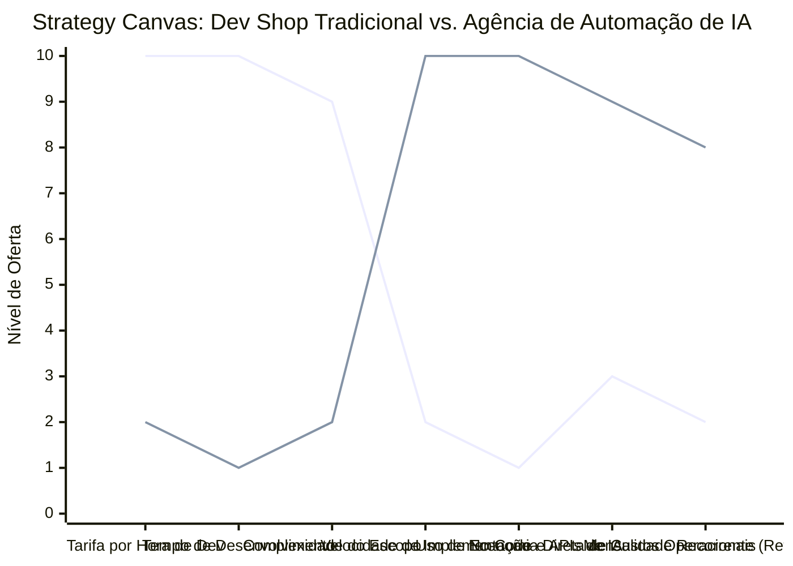

# Estudo de Caso Blue Ocean: Agência de Automação de IA

## De "Desenvolvimento de Software" para "Arquiteto de Processos e Eficiência Operacional"

### 1. O Cenário Atual (Oceano Vermelho)

O mercado tradicional de desenvolvimento de software e agências de tecnologia enfrenta grande saturação e comoditização:

1. **Guerra de Tarifas de Programação:** Agências e desenvolvedores competem cobrando taxas de hora/desenvolvimento cada vez mais baixas devido à concorrência global e plataformas de freelancers.
2. **Projetos Longos e Incertos:** Escopos complexos que levam meses ou anos para serem entregues, frequentemente estourando orçamentos e prazos, gerando frustração ao cliente.
3. **Foco no Código e Não no Retorno:** Agências focam na beleza técnica do código ("software feito sob medida") em vez de resolver gargalos reais de produtividade e margem do cliente.
4. **Alta Barreira Financeira e Técnica:** O custo de desenvolver uma solução própria do zero é proibitivo para a maioria das pequenas e médias empresas (PMEs).

### 2. A Estratégia do Oceano Azul: "Arquiteto de Processos e IA Sem Código"

A estratégia propõe desviar a agência do modelo tradicional de "vender código sob demanda" para o modelo de **Agência de Automação de IA (AI Automation Agency - AAA)**, combinando ferramentas No-Code/Low-Code (Make, Zapier, n8n) com Modelos de Linguagem de IA (OpenAI, Anthropic) para automatizar fluxos de trabalho inteiros em dias.

**A Nova Proposta de Valor:**

- **Foco:** Pequenas e médias empresas que precisam eliminar tarefas manuais repetitivas (atendimento, triagem de leads, relatórios, faturamento) para reduzir custos operacionais imediatos.
- **Ambiente:** Entrega de microsserviços e agentes de IA que rodam de forma invisível nas ferramentas que o cliente já usa (Slack, WhatsApp, CRM).
- **Modelo de Negócio:** Cobrança produtizada por "Automatizações Prontas" (Setup rápido) acrescida de um retainer recorrente mensal de suporte e otimização de IA (Retainer de IA), focado na economia real de horas-homem gerada.

### 3. Strategy Canvas (Tela Estratégica)

O gráfico abaixo ilustra a transição de focar em programação manual e escopos longos para focar em velocidade de implementação e retorno financeiro tangível.

**Legenda:**

- **Linha 1:** Dev Shop / Fábrica de Software Tradicional
- **Linha 2:** Agência de Automação de IA (Blue Ocean)

> **Nota:** A Agência de Automação de IA reduz quase a zero a Tarifa por Hora de Programação e o Tempo de Desenvolvimento, permitindo elevar ao máximo a Velocidade de Implementação e focar exclusivamente no Retorno Financeiro/Economia de Custos do cliente.

### 4. Framework das Quatro Ações (ERRC Grid)

| Ação         | O que fazer                                                                                                                                                                                                            |
| :----------- | :--------------------------------------------------------------------------------------------------------------------------------------------------------------------------------------------------------------------- |
| **ELIMINAR** | **Desenvolvimento do zero (Custom Code):** Eliminar a necessidade de programar frameworks complexos de infraestrutura. **Venda de horas brutas:** Eliminar a cobrança por tempo de codificação.                     |
| **REDUZIR**  | **Tempo de entrega:** Reduzir o tempo de go-to-market de meses para menos de duas semanas. **Complexidade do projeto:** Evitar integrações manuais custosas onde APIs prontas e No-Code resolvem.                      |
| **AUMENTAR** | **Velocidade de Execução:** Entregar automações visíveis que geram valor no primeiro dia de uso. **Foco em ROI Operacional:** Demonstrar matematicamente quantas horas de trabalho humano foram economizadas pela IA. |
| **CRIAR**    | **Agentes de IA Produtizados:** Criar assistentes de atendimento de IA com integração profunda no CRM e WhatsApp. **Retainer de Manutenção de IA:** Modelo de assinatura recorrente para garantir que as APIs e fluxos rodem perfeitamente. |

### 5. Conclusão

Parar de brigar pelo menor custo de programação e passar a ser o parceiro que reduz custos operacionais em escala. Ao usar plataformas de IA e No-Code, a agência entrega resultados em dias em vez de meses. O empresário não paga pela beleza do código escrito, ele paga para ver sua equipe livre de trabalho repetitivo. Isso cria um novo espaço de mercado altamente rentável, escalável e com faturamento recorrente garantido.

### 6. Veja Também (Outros Estudos de Caso)

- [Consultoria Empreendedora](./consultoria-empreendedora.md)
- [BPO Financeiro e Contabilidade Consultiva](./bpo-financeiro-e-contabilidade.md)
- [Startup B2B SaaS](./startup-b2b-saas.md)
- [Agência de Marketing](./agencia-de-marketing.md)
- [Micro Mercado Autónomo](./micro-mercado-autonomo.md)
- [Turismo de Compras Têxtil](./turismo-compras-textil.md)
- [Pousadas e Campings](./pousadas-e-campings.md)
- [Academia de Escalada](./academia-de-escalada.md)
- [Personal Trainer](./personal-trainer.md)
- [Barbearia](./barbearia.md)
- [Clínica de Estética](./clinica-de-estetica.md)
- [Pet Shop](./pet-shop.md)
- [Cafeteria](./cafeteria.md)
- [Oficina Mecânica](./oficina-mecanica.md)
- [Escola de Idiomas](./escola-de-idiomas.md)
- [Food Truck e Comida de Rua](./food-truck.md)
- [Delivery de Comida Saudável](./delivery-de-comida-saudavel.md)
- [Loja de Roupas](./loja-de-roupas.md)
- [Estúdio de Yoga](./estudio-de-yoga.md)
- [Coworking de Nicho](./coworking-de-nicho.md)
- [Imobiliária Consultiva](./imobiliaria-consultiva.md)
