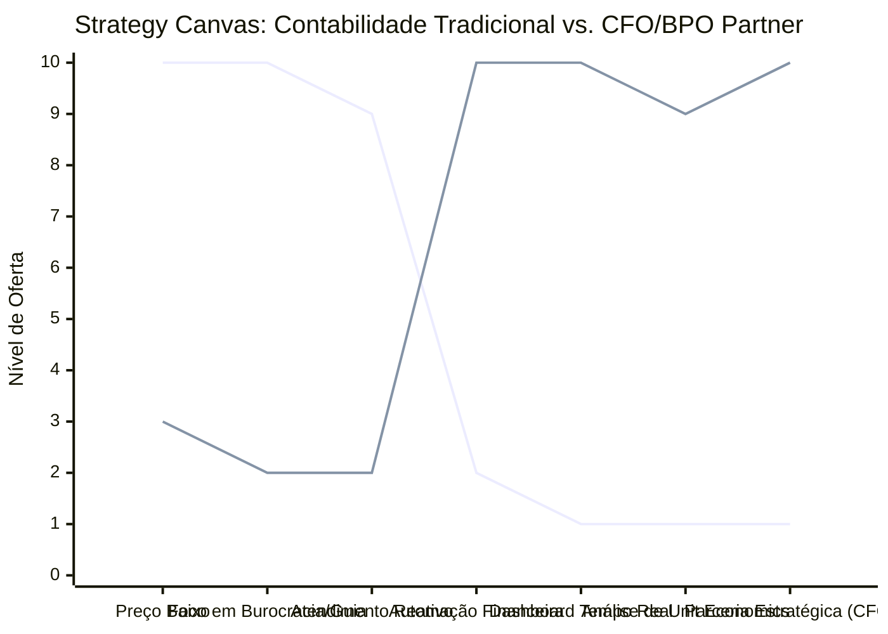

# Estudo de Caso Blue Ocean: BPO Financeiro e Contabilidade Consultiva

## De "Burocracia Fiscal" para "CFO Partner e Inteligência de Negócios"

### 1. O Cenário Atual (Oceano Vermelho)

O mercado tradicional de contabilidade para pequenas e médias empresas (PMEs) é comoditizado e focado em obrigações legais:

1. **Guerra de Preços por Mensalidades:** Escritórios competem oferecendo a mensalidade mais barata (ex: R$ 199/mês) apenas para emitir guias de impostos e folhas de pagamento.
2. **Atendimento Reativo:** O contador funciona como um "mal necessário", sendo procurado apenas quando há problemas fiscais ou para enviar documentos obrigatórios.
3. **Foco no Passado:** Os relatórios contábeis tradicionais (DRE, Balanço) são entregues com meses de atraso, servindo apenas para o governo e sendo inúteis para a tomada de decisão do empresário.

### 2. A Estratégia do Oceano Azul: "CFO Partner e BPO Consultivo"

A estratégia propõe a transição do papel de "calculador de impostos" para o de "diretor financeiro terceirizado" (CFO as a Service) com BPO (Business Process Outsourcing) financeiro automatizado, integrando tecnologia para gerar inteligência de negócios em tempo real.

**A Nova Proposta de Valor:**

- **Foco:** Fundadores, startups e PMEs em crescimento que não podem pagar um CFO interno de R$ 15k/mês, mas precisam de controle financeiro rigoroso e direcionamento estratégico para lucrar.
- **Ambiente:** Operação 100% digital baseada em integrações automatizadas (ERP, conciliação bancária por API) e dashboards interativos.
- **Modelo de Negócio:** Cobrança recorrente (Retainer) de alto valor (de R$ 1.500 a R$ 5.000/mês) ancorada no valor gerado pela redução de custos operacionais e aumento de margem.

### 3. Strategy Canvas (Tela Estratégica)

Comparativo entre a contabilidade tradicional focada em guias fiscais e a parceria estratégica de CFO/BPO.

**Legenda:**

- **Linha 1:** Contabilidade Tradicional
- **Linha 2:** CFO/BPO Partner (Blue Ocean)

> **Nota:** O parceiro de CFO/BPO reduz drasticamente a relevância do preço baixo e do atendimento reativo, focando em automação, dashboards em tempo real e assessoria estratégica direta que salva o caixa do cliente.

### 4. Framework das Quatro Ações (ERRC Grid)

| Ação         | O que fazer                                                                                                                                                                                                            |
| :----------- | :--------------------------------------------------------------------------------------------------------------------------------------------------------------------------------------------------------------------- |
| **ELIMINAR** | **Papelada e digitação manual:** Acabar com o envio de notas fiscais e extratos físicos pelo cliente. **Cobrança por envio de guias:** Parar de cobrar taxas extras para enviar obrigações básicas de rotina.      |
| **REDUZIR**  | **Tempo gasto em reuniões burocráticas:** Reduzir discussões técnicas sobre leis tributárias e focar em estratégias de caixa. **Erros de conciliação:** Automatizar a coleta de extratos bancários de todas as contas. |
| **AUMENTAR** | **Frequência de contato estratégico:** Reuniões mensais rápidas e produtivas de apresentação de resultados. **Previsibilidade financeira:** Entregar fluxo de caixa projetado para os próximos 3 a 6 meses.          |
| **CRIAR**    | **BPO Financeiro integrado:** Assumir o faturamento, contas a pagar e contas a receber do cliente. **Dashboard de Unit Economics:** Criar relatórios de margem de contribuição por produto/serviço e CAC/LTV.     |

### 5. Conclusão

Sair da conformidade legal invisível e entrar no coração financeiro da empresa do cliente. Ao assumir a operação financeira diária (BPO) e analisar os números estrategicamente (CFO as a Service), o profissional de finanças se torna o parceiro mais valioso do empresário. A mensalidade deixa de ser vista como um "imposto contábil" e passa a ser avaliada como um investimento altamente rentável que protege o caixa e multiplica o lucro da empresa.

### 6. Veja Também (Outros Estudos de Caso)

- [Consultoria Empreendedora](./consultoria-empreendedora.md)
- [Agência de Marketing](./agencia-de-marketing.md)
- [Mentoria Premium e Educação de Elite](./mentoria-premium-e-educacao.md)
- [Fisioterapia de Longevidade e Performance](./fisioterapia-e-longevidade.md)
- [Turismo de Compras Têxtil](./turismo-compras-textil.md)
- [Pousadas e Campings](./pousadas-e-campings.md)
- [Academia de Escalada](./academia-de-escalada.md)
- [Personal Trainer](./personal-trainer.md)
- [Startup B2B SaaS](./startup-b2b-saas.md)
- [Coworking de Nicho](./coworking-de-nicho.md)
- [Imobiliária Consultiva](./imobiliaria-consultiva.md)
