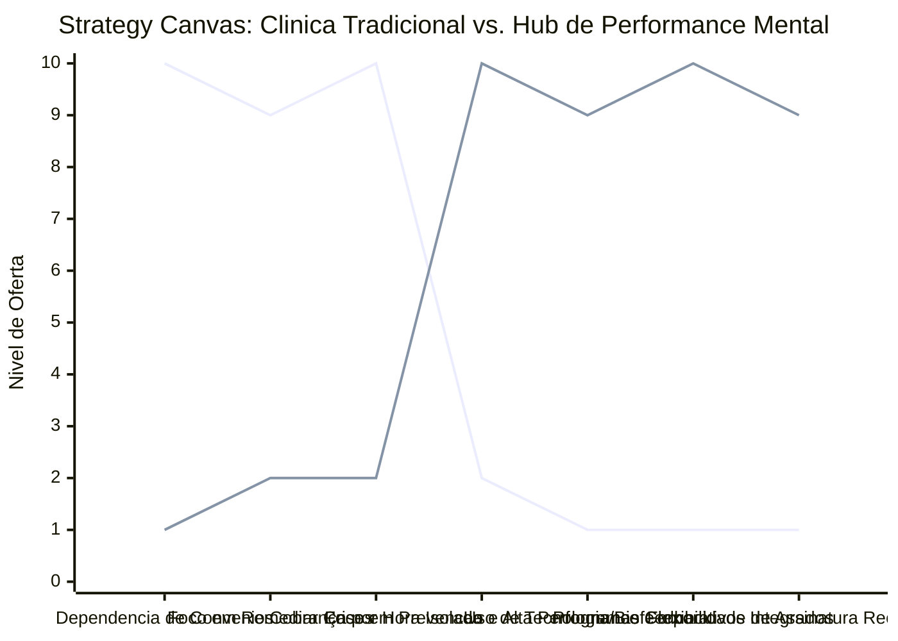

# Estudo de Caso Blue Ocean: Clinica de Psicologia

## De "Aluguel de Hora de Terapia" para "Hub de Saude Mental e Desenvolvimento de Carreira"

### 1. O Cenario Atual (Oceano Vermelho)

O mercado tradicional de consultorios de psicologia e clinicas de saude mental e historicamente focado na venda reativa de horas de atendimento individual:

1. **Venda de Horas-Sessao (Teto de Faturamento):** O psicologo troca diretamente o seu tempo por dinheiro. Quando nao esta atendendo fisicamente ou por videochamada, a receita cessa imediatamente, limitando severamente a escala do negocio.
2. **Abordagem Reativa de Tratamento:** A busca pelo profissional acontece quase exclusivamente quando o cliente ja esta em crise aguda de ansiedade, depressao ou esgotamento (Burnout), focando apenas na remediacao de sintomas.
3. **Estigma e Barreiras de Entrada:** A terapia tradicional ainda e vista por muitos como algo reservado apenas a quem possui patologias graves, afastando um vasto publico corporativo e executivo que busca desenvolvimento pessoal.
4. **Guerra de Precos e Reembolso de Convenios:** Clinicas disputam pacientes com base no valor reembolsado por planos de saude, o que achata os honorarios profissionais e compromete a qualidade da atencao prestada.

### 2. A Estrategia do Oceano Azul: "Hub de Performance Mental"

A estrategia propoe reposicionar o consultorio de psicologia tradicional para um Hub de Saude Mental Preventiva, Gestao de Estresse e Alta Performance Emocional, integrando a psicologia clinica tradicional a ferramentas de desenvolvimento de carreira e biofeedback.

**A Nova Proposta de Valor:**

- **Foco:** Executivos, fundadores de startups e profissionais de alta performance que enfrentam rotinas extremas de estresse e buscam resiliencia mental, foco e desenvolvimento de lideranca, eliminando o estigma da "doenca".
- **Ambiente:** Clinica de alto padrao estetiocognitivo, equipada com salas de descompressao sensorial, tecnologia de monitoramento de biofeedback (variabilidade da frequencia cardiaca) e estetica voltada ao bem-estar e foco.
- **Modelo de Negocio:** Assinatura mensal de gestao de saude mental corporativa e individual (retainers preventivos), workshops corporativos sob demanda e programas estruturados de mentoria emocional de curta duracao com alto ticket.

### 3. Strategy Canvas (Tela Estrategica)

Comparativo entre a clinica de psicologia convencional baseada em sessoes avulsas e o novo modelo de Hub de Performance Mental e Prevencao de Estresse.

**Legenda:**

- **Linha 1:** Clinica de Psicologia Tradicional
- **Linha 2:** Hub de Performance Mental (Blue Ocean)

> **Nota:** O Hub de Performance Mental reduz drasticamente a dependencia de planos de saude e o foco em remediar crises, direcionando todos os recursos para a alta performance emocional, tecnologia de biofeedback e planos corporativos de assinatura.

### 4. Framework das Quatro Acoes (ERRC Grid)

| Acao         | O que fazer                                                                                                                                                                                                            |
| :----------- | :--------------------------------------------------------------------------------------------------------------------------------------------------------------------------------------------------------------------- |
| **ELIMINAR** | **Venda exclusiva de sessoes avulsas de 50 minutos:** Substituir por programas de desenvolvimento emocional de escopo fechado. **Aceitacao de convenios de baixo reembolso:** Sair da guerra de precos de saude basica. |
| **REDUZIR**  | **Tempo de espera por triagem:** Implementar avaliacoes digitais preliminares agilizando o direcionamento do cliente. **Abordagem puramente patologica:** Minimizar o jargao psiquiatrico que intimida o publico corporativo. |
| **AUMENTAR** | **Acompanhamento Assincrono:** Oferecer suporte via aplicativo de diario emocional e exercicios de respiracao semanais. **Prestigio e Conforto do Espaço:** Criar cabines individuais de isolamento acustico e descompressao. |
| **CRIAR**    | **Planos de Assinatura Corporativa (B2B):** Pacotes de saude mental preventiva e analise de clima emocional para lideranças de PMEs. **Treinamento de Biofeedback:** Utilizacao de sensores portateis para ensinar o controle da ansiedade em tempo real. |

### 5. Conclusao

Desvincular o psicologo do papel de mero vendedor de horas clinicas reativas. Ao formatar programas estruturados voltados a prevencao do Burnout e desenvolvimento de liderancas corporativas, a clinica acessa o orcamento de educacao e beneficios das organizacoes e o bolso do profissional liberal de alta renda. O faturamento ganha previsibilidade com o modelo de assinatura recorrente e o valor percebido explode ao associar saude mental com produtividade, resiliencia e alta performance.

### 6. Veja Também (Outros Estudos de Caso)

- [Fisioterapia de Longevidade e Performance](./fisioterapia-e-longevidade.md)
- [Estetica Automotiva Premium](./estetica-automotiva.md)
- [Personal Trainer](./personal-trainer.md)
- [Consultoria Empreendedora](./consultoria-empreendedora.md)
- [Estúdio de Yoga](./estudio-de-yoga.md)
- [Clinica de Estetica](./clinica-de-estetica.md)
- [Pousadas e Campings](./pousadas-e-campings.md)
