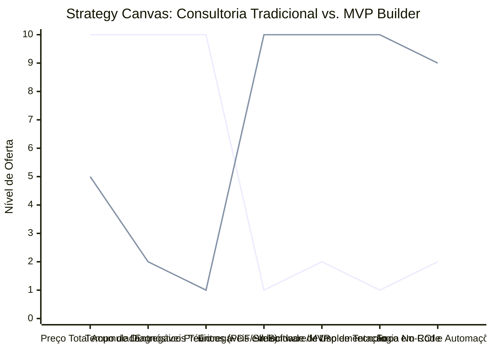

# Estudo de Caso Blue Ocean: Consultoria Empreendedora

## De "Relatórios e Planilhas" para "MVP Builder e Consultoria de Implementação"

### 1. O Cenário Atual (Oceano Vermelho)

O mercado de consultoria de negócios tradicional para pequenas e médias empresas é frequentemente criticado por ser excessivamente acadêmico, lento e caro:

1. **Entregáveis Estáticos ("Foco no Papel"):** O resultado do serviço costuma ser calhamaços de relatórios em PDF, apresentações de slides com análises teóricas (como SWOT clássico) e planos de negócios extensos que se tornam obsoletos rapidamente.
2. **Ciclos de Diagnóstico Longos:** Exigência de semanas ou meses de levantamento de dados, entrevistas e reuniões de alinhamento antes que o cliente veja qualquer ação prática ou teste empírico de mercado.
3. **Cobrança Baseada em Horas (Burocracia de Horas):** Remuneração baseada no tempo gasto pelo consultor em reuniões presenciais e visitas, o que não incentiva a agilidade e a busca de soluções imediatas.
4. **Falta de Domínio Técnico:** Consultores de negócios focados puramente em gestão, sem competência técnica ou de desenvolvimento para de fato construir as soluções digitais necessárias para automatizar a operação do cliente.

### 2. A Estratégia do Oceano Azul: "MVP Builder & Tech Consultant"

A estratégia propõe a transição completa da entrega de relatórios de diagnóstico passivos para a construção ativa de soluções tecnológicas validadas, focando no conceito de "Execução de MVP" (Minimum Viable Product) e automações ágeis de processos.

**A Nova Proposta de Valor:**

- **Foco:** Fundadores, PMEs e pequenos empresários que precisam validar ideias de novos canais de vendas, estruturar fluxos comerciais ou automatizar tarefas rotineiras, sem ter o capital para contratar desenvolvedores seniores ou agências caras.
- **Ambiente:** Desenvolvimento rápido usando ferramentas Low-Code/No-Code modernas (Make, Bubble, Airtable, Notion) para criar fluxos funcionais que resolvem o problema em dias.
- **Modelo de Negócio:** Cobrança por "Sprint de Execução" ou "Produto Pronto", eliminando reuniões longas e focando em entregar um sistema ativo com modelo de assinatura recorrente (retainer) focado em melhoria operacional.

### 3. Strategy Canvas (Tela Estratégica)

O gráfico compara a consultoria empresarial tradicional, focada em diagnóstico e papel, com o modelo de MVP Builder (Tech Consultant).

**Legenda:**

- **Linha 1:** Consultoria de Negócios Tradicional
- **Linha 2:** MVP Builder / Tech Consultant (Blue Ocean)

> **Nota:** O MVP Builder corta drasticamente o tempo gasto em diagnósticos longos e relatórios em papel para concentrar 100% de seus esforços em software funcional, velocidade de implementação e automações diretas para o cliente.

### 4. Framework das Quatro Ações (ERRC Grid)

| Ação         | O que fazer                                                                                                                                                                                                                         |
| :----------- | :---------------------------------------------------------------------------------------------------------------------------------------------------------------------------------------------------------------------------------- |
| **ELIMINAR** | **Relatórios estáticos em PDF:** Substituir por dashboards funcionais que exibem dados operacionais em tempo real. **Cobrança por hora de reunião:** Cobrar estritamente por entregáveis funcionais de cada sprint.              |
| **REDUZIR**  | **Tempo de Diagnóstico Prévio:** Substituir reuniões burocráticas por testes rápidos "no campo" com clientes reais. **Burocracia de aprovação:** Simplificar o escopo focando estritamente em resolver o gargalo imediato.         |
| **AUMENTAR** | **Foco em Execução Ágil:** Entregas rápidas de protótipos funcionais que o cliente pode operar no dia seguinte. **Agilidade Comercial:** Implementar automações de captura e triagem de leads de forma instantânea.               |
| **CRIAR**    | **Construção de MVPs No-Code:** Desenvolver aplicativos de controle interno, CRMs integrados e portais de atendimento. **Automação de Backoffice:** Criar integrações inteligentes entre sistemas para eliminar digitação manual. |

### 5. Conclusão

Produtizar o serviço de assessoria e entregar soluções integradas que rodam na prática. Ao assumir o papel de construtor tecnológico rápido usando No-Code, o consultor rompe com a barreira de vender apenas conselhos. O cliente paga satisfeito porque vê o software funcionando, os dados centralizados e a sua equipe operando de forma mais eficiente. Isso justifica contratos recorrentes estáveis voltados a escalar a infraestrutura interna da empresa.

### 6. Veja Também (Outros Estudos de Caso)

- [Clínica de Psicologia](./clinica-de-psicologia.md)
- [Estética Automotiva](./estetica-automotiva.md)
- [BPO Financeiro e Contabilidade Consultiva](./bpo-financeiro-e-contabilidade.md)
- [Mentoria Premium e Educação de Elite](./mentoria-premium-e-educacao.md)
- [Fisioterapia de Longevidade e Performance](./fisioterapia-e-longevidade.md)
- [Turismo de Compras Têxtil](./turismo-compras-textil.md)
- [Pousadas e Campings](./pousadas-e-campings.md)
- [Academia de Escalada](./academia-de-escalada.md)
- [Personal Trainer](./personal-trainer.md)
- [Agência de Marketing](./agencia-de-marketing.md)
- [Barbearia](./barbearia.md)
- [Clínica de Estética](./clinica-de-estetica.md)
- [Pet Shop](./pet-shop.md)
- [Cafeteria](./cafeteria.md)
- [Oficina Mecânica](./oficina-mecanica.md)
- [Escola de Idiomas](./escola-de-idiomas.md)
- [Startup B2B SaaS](./startup-b2b-saas.md)
- [Food Truck e Comida de Rua](./food-truck.md)
- [Delivery de Comida Saudável](./delivery-de-comida-saudavel.md)
- [Loja de Roupas](./loja-de-roupas.md)
- [Estúdio de Yoga](./estudio-de-yoga.md)
- [Coworking de Nicho](./coworking-de-nicho.md)
- [Imobiliária Consultiva](./imobiliaria-consultiva.md)
