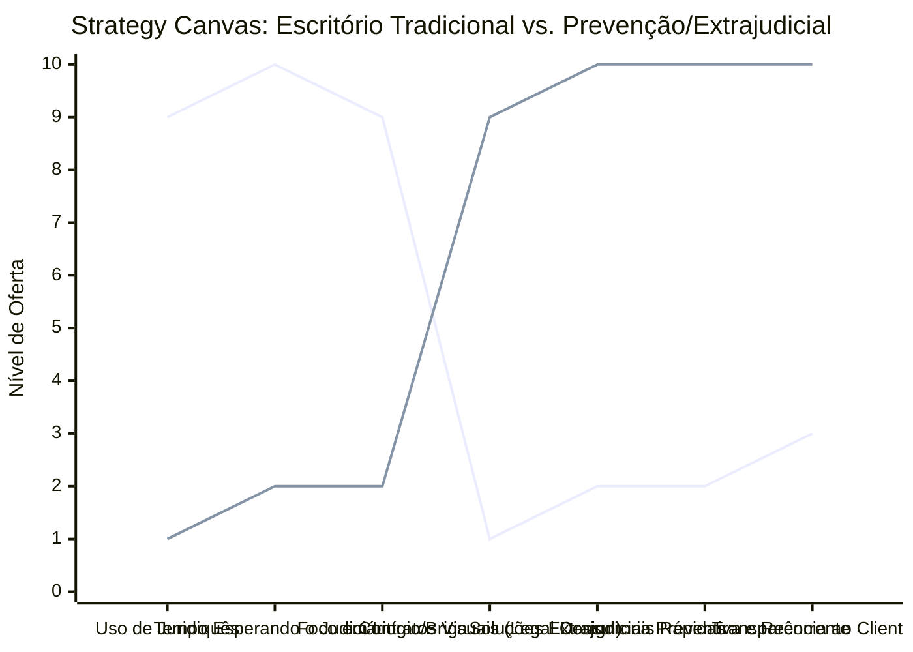

# Estudo de Caso Blue Ocean: Escritório de Advocacia

## Da "Batalha Judicial Tradicional" para "Prevenção e Solução Extrajudicial Ágil"

### 1. O Cenário Atual (Oceano Vermelho)

O mercado tradicional de advocacia sofre com alta concorrência, morosidade e faturamento atrelado ao tempo:

1. **Foco no Litígio Longo:** Escritórios que vivem de processos judiciais arrastados, onde o cliente não entende o juridiquês e se sente refém do tempo.
2. **Cobrança Imprevisível:** Honorários complexos baseados em taxas iniciais somadas a um percentual imprevisível ao final de processos de anos.
3. **Atendimento Frio e Reativo:** O advogado só é acionado quando o problema já explodiu, atuando como "bombeiro" e não como parceiro de negócios.

### 2. A Estratégia do Oceano Azul: "Advocacia Preventiva e Extrajudicial"

A estratégia propõe uma transição da advocacia de contencioso demorado para a atuação extrajudicial (acordos rápidos, mediação) e a consultoria preventiva focada na saúde e segurança financeira da empresa do cliente.

**A Nova Proposta de Valor:**

- **Foco:** Pequenas e médias empresas (ou clientes pessoas físicas) que buscam evitar o judiciário, reduzir riscos e resolver conflitos rapidamente, mesmo que isso custe mais no curto prazo.
- **Ambiente:** Tecnológico e direto (Legal Design, contratos visuais, reuniões ágeis), eliminando a formalidade desnecessária e o juridiquês.
- **Modelo de Negócio:** Receita recorrente (Fee Mensal) para consultoria preventiva ou cobrança por soluções rápidas e pacotes de acordos extrajudiciais.

### 3. Strategy Canvas (Tela Estratégica)

O gráfico compara o modelo do escritório contencioso com o novo modelo focado em prevenção e agilidade.

**Legenda:**

- **Linha 1:** Escritório Tradicional (Contencioso)
- **Linha 2:** Prevenção e Extrajudicial (Blue Ocean)

### 4. Framework das Quatro Ações (ERRC Grid)

| Ação         | O que fazer                                                                                                                                                                                                                                               |
| :----------- | :-------------------------------------------------------------------------------------------------------------------------------------------------------------------------------------------------------------------------------------------------------- |
| **ELIMINAR** | **Juridiquês desnecessário:** Falar a língua do empreendedor ou do cliente final. **Dependência total do Judiciário:** Deixar de vender a ilusão de que a "justiça estatal" é o único caminho.                                                         |
| **REDUZIR**  | **Tempo de resposta:** Reduzir o tempo que o cliente fica "no escuro" sobre o andamento do caso. **Processos judiciais longos:** Menos brigas desgastantes de 5 a 10 anos.                                                                             |
| **AUMENTAR** | **Acordos e Mediações:** Focar massivamente na resolução amigável e rápida dos conflitos. **Transparência:** Mostrar ao cliente exatamente onde ele está e os próximos passos de forma visual.                                                         |
| **CRIAR**    | **Legal Design em Contratos:** Tornar os contratos agradáveis e fáceis de ler. **Planos de Assinatura Preventiva:** Vender "tranquilidade mensal" onde o escritório audita a empresa para que ela não seja processada (Compliance Trabalhista/Fiscal). |

### 5. Conclusão

Sair da briga por "quem cobra mais barato no percentual de êxito" no fim de um processo demorado. Ao focar em prevenir riscos (compliance, estruturação de contratos inteligentes) e resolver conflitos rápido (extrajudicial), o escritório atrai clientes dispostos a pagar por tranquilidade, previsibilidade e agilidade, garantindo um fluxo de caixa constante via contratos recorrentes ou honorários pagos pelo sucesso rápido em acordos.

### 6. Veja Também (Outros Estudos de Caso)

- [Turismo de Compras Têxtil](./turismo-compras-textil.md)
- [Pousadas e Campings](./pousadas-e-campings.md)
- [Academia de Escalada](./academia-de-escalada.md)
- [Personal Trainer](./personal-trainer.md)
- [Consultoria Empreendedora](./consultoria-empreendedora.md)
- [Agência de Marketing](./agencia-marketing.md)
- [Barbearia](./barbearia.md)
- [Clínica de Estética](./estetica-e-beleza.md)
- [Pet Shop](./pet-shop.md)
- [Cafeteria](./cafeteria.md)
- [Oficina Mecânica](./oficina-mecanica.md)
- [Escola de Idiomas](./escola-idiomas.md)
- [Startup B2B SaaS](./startup-saas.md)
- [Food Truck e Comida de Rua](./food-truck.md)
- [Delivery de Comida Saudável](./delivery-saudavel.md)
- [Loja de Roupas](./loja-roupas.md)
- [Estúdio de Yoga](./estudio-yoga.md)
- [Coworking de Nicho](./coworking.md)
- [Imobiliária Consultiva](./imobiliaria.md)
