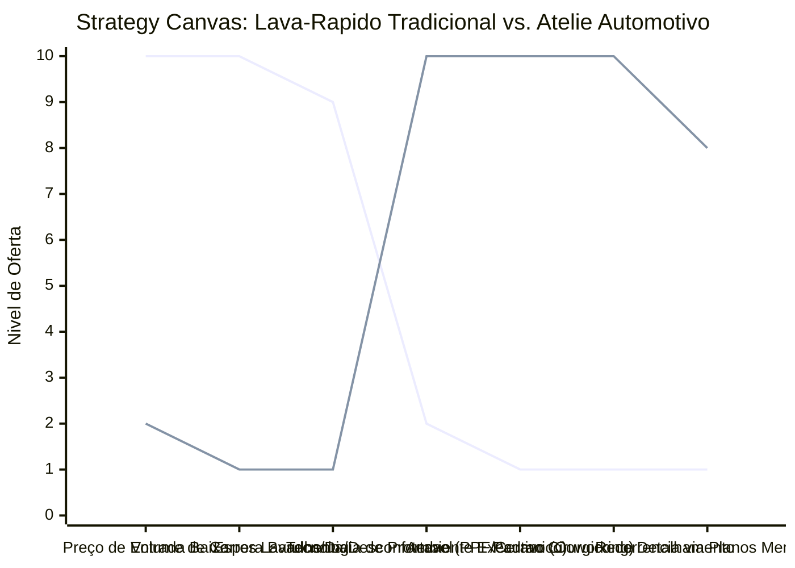

# Estudo de Caso Blue Ocean: Estetica Automotiva

## De "Lava-Rapido de Bairro" para "Atelie de Detalhamento Automotivo e Social Club"

### 1. O Cenario Atual (Oceano Vermelho)

O mercado tradicional de lavagem, polimento e estetica automotiva sofre com margens severamente reduzidas e alta concorrencia:

1. **Guerra de Precos na Lavagem Simples:** Concorrencia acirrada com estabelecimentos informais baseada exclusivamente no menor preco cobrado para "jogar agua e sabao".
2. **Tempo de Espera e Desconforto:** Ambientes de espera insalubres, barulhentos, sem climatizacao ou espaco para trabalho, forcando o cliente a perder horas produtivas ou deixar o carro e voltar depois.
3. **Falta de Padronizacao e Confianca:** Uso de produtos quimicos agressivos que danificam a pintura a longo prazo e falta de clareza nos processos tecnicos aplicados.
4. **Baixa Recorrencia Previsivel:** O cliente so busca o servico quando o carro esta extremamente sujo ou na hora de vende-lo, gerando grande oscilacao de faturamento mensal.

### 2. A Estrategia do Oceano Azul: "Atelie Automotivo & Cafe-Coworking"

A estrategia propoe reposicionar o lava-rapido convencional para um Atelie de Detalhamento Automotivo Premium integrado a um Cafe-Coworking de alto padrao. O espaco se torna um "Social Club" para entusiastas e um escritorio de transicao confortavel para executivos.

**A Nova Proposta de Valor:**

- **Foco:** Proprietarios de veiculos premium, executivos e colecionadores que valorizam o cuidado minucioso com o patrimonio e que precisam de um espaco premium para trabalhar enquanto o carro recebe cuidados.
- **Ambiente:** Oficina com estetica de laboratorio (iluminacao LED cirurgica, piso epoxi impecavel), sem barulho excessivo de compressores, e um mezanino com cafeteria gourmet, internet dedicada de alta velocidade e salas de reuniao privadas.
- **Modelo de Negocio:** Planos de assinatura mensal de manutencao estetica (Membership), servicos de altissimo ticket (vitrificacao de pintura, protecao PPF autorregenerativa) e faturamento cruzado com consumo na cafeteria e eventos privados de marcas.

### 3. Strategy Canvas (Tela Estratégica)

Comparativo entre o lava-rapido comum baseado em volume e o Atelie de Detalhamento Automotivo com Cafe-Coworking integrado.

**Legenda:**

- **Linha 1:** Lava-Rapido Tradicional
- **Linha 2:** Atelie Automotivo & Social Club (Blue Ocean)

> **Nota:** O Atelie Automotivo reduz ao minimo o foco em volume de lavagens rapidas de baixo custo, elevando ao maximo a tecnologia de protecao de pintura, o refinamento do detalhamento estetico e a conveniencia de um espaco de trabalho corporativo premium para o cliente.

### 4. Framework das Quatro Acoes (ERRC Grid)

| Acao         | O que fazer                                                                                                                                                                                                            |
| :----------- | :--------------------------------------------------------------------------------------------------------------------------------------------------------------------------------------------------------------------- |
| **ELIMINAR** | **Lavagens rapidas e abrasivas:** Banir o uso de vassouras, panos sujos de chao e produtos corrosivos que arranham a lataria. **Ambiente barulhento de recepcao:** Isolar acusticamente a area de lavagem e maquinario. |
| **REDUZIR**  | **Volume diario de veiculos:** Reduzir o giro para focar em poucos atendimentos premium personalizados por dia. **Guerra de precos local:** Abandonar tabelas baseadas nos concorrentes do bairro.                   |
| **AUMENTAR** | **Tecnologia Quimica de Protecao:** Utilizacao exclusiva de xampus de pH neutro, ceras de carnauba premium e revestimentos nanotecnologicos. **Ticket Medio:** Elevar as margens atraves de pacotes de longa duracao. |
| **CRIAR**    | **Espaco Cafe-Coworking Executivo:** Cafe gourmet e estacoes de trabalho climatizadas de alta qualidade para que o cliente nao perca tempo produtivo. **Clube de Assinatura Automotiva:** Lavagens de manutencao quinzenais recorrentes e agendadas. |

### 5. Conclusao

Sair da commoditizacao da agua e do sabao para vender conservacao de patrimonio, design e experiencia produtiva. Ao oferecer um coworking integrado, o cliente nao "perde tempo" esperando pelo carro; ele apenas muda de escritorio por algumas horas. O atelie automotivo atrai um publico de altissimo poder aquisitivo disposto a pagar mensalidades de assinatura de alto ticket para manter a frota impecavel, otimizando o fluxo de caixa do negocio de forma estavel e previsivel.

### 6. Veja Também (Outros Estudos de Caso)

- [Oficina Mecânica Consultiva](./oficina-mecanica.md)
- [Clinica de Psicologia](./clinica-de-psicologia.md)
- [Imobiliária Consultiva](./imobiliaria-consultiva.md)
- [Turismo de Compras Têxtil](./turismo-compras-textil.md)
- [Pousadas e Campings](./pousadas-e-campings.md)
- [Academia de Escalada](./academia-de-escalada.md)
- [Personal Trainer](./personal-trainer.md)
- [Consultoria Empreendedora](./consultoria-empreendedora.md)
