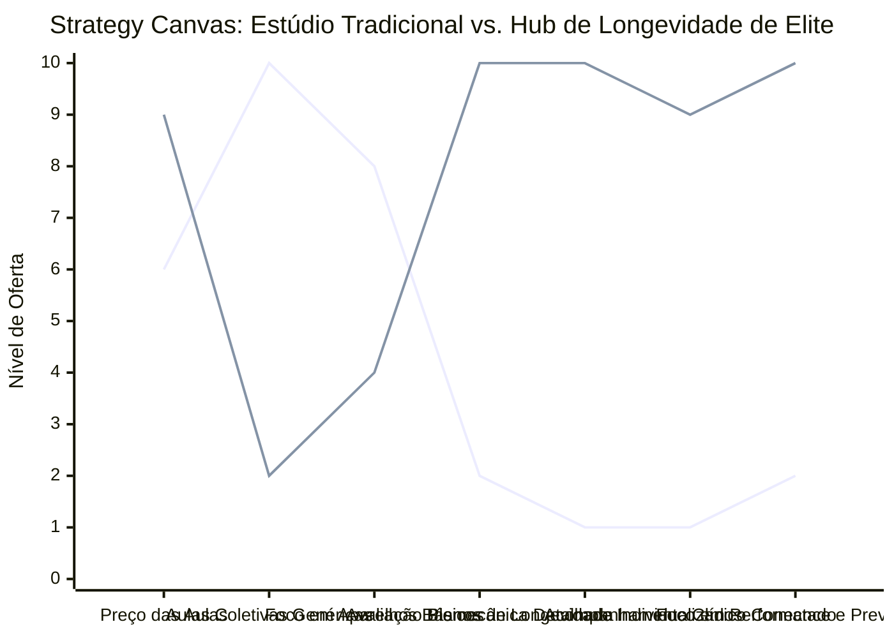

# Estudo de Caso Blue Ocean: Estúdio de Pilates de Nicho

## De "Aulas de Pilates Genéricas" para "Hub de Longevidade e Reabilitação de Elite"

### 1. O Cenário Atual (Oceano Vermelho)

O mercado de estúdios de Pilates tradicional é caracterizado por alta fragmentação de pequenos estúdios de bairro e extrema comoditização:

1. **Guerra de Preços por Aula:** Competição feroz por pacotes mensais ou semanais baratos de aulas coletivas com até 4 ou 5 alunos por professor.
2. **Abordagem Genérica de Aulas:** Sessões de treino idênticas para perfis de clientes completamente diferentes (ex: idosos com hérnia de disco treinando lado a lado com atletas de alta performance).
3. **Falta de Mensuração de Resultados:** A evolução postural do aluno é avaliada de forma meramente subjetiva, sem dados concretos, relatórios biomecânicos ou fotos estruturadas de progresso.
4. **Baixa Retenção e Alta Rotatividade:** Devido à falta de uma proposta de valor clara e de personalização profunda, os alunos abandonam as aulas facilmente para testar outras modalidades mais baratas.

### 2. A Estratégia do Oceano Azul: "Longevidade Ativa e Reabilitação de Elite"

A estratégia propõe abandonar o modelo de "aluguel de aparelhos e acompanhamento genérico" para reposicionar o estúdio como um Hub de Longevidade e Fortalecimento de Precisão, combinando Pilates Clínico, Biomecânica de Elite e tecnologia de monitoramento de saúde.

**A Nova Proposta de Valor:**

- **Foco:** Profissionais de alta renda, executivos estressados e a população sênior premium que busca reabilitação de lesões crônicas, longevidade articular e melhoria de performance física sem o desgaste de academias tradicionais.
- **Ambiente:** Design minimalista, acústica relaxante, banheiros individuais premium e foco em atendimento individual (1:1) ou no máximo em duplas extremamente alinhadas.
- **Modelo de Negócio:** Planos semestrais ou anuais recorrentes de alto valor, integrados a uma avaliação de biofotogrametria computadorizada mensal e relatórios digitais enviados diretamente para os médicos dos clientes.

### 3. Strategy Canvas (Tela Estratégica)

O gráfico compara a oferta do estúdio de Pilates genérico com o novo modelo de Hub de Longevidade e Reabilitação de Elite.

**Legenda:**

- **Linha 1:** Estúdio de Pilates Tradicional
- **Linha 2:** Hub de Longevidade de Elite (Blue Ocean)

> **Nota:** O Hub de Longevidade reduz o foco em aulas genéricas coletivas para se concentrar inteiramente em Avaliação Biomecânica, Planos de Longevidade Personalizados e Conexão Clínica, justificando cobrar um preço premium extremamente elevado.

### 4. Framework das Quatro Ações (ERRC Grid)

| Ação         | O que fazer                                                                                                                                                                                                                                              |
| :----------- | :------------------------------------------------------------------------------------------------------------------------------------------------------------------------------------------------------------------------------------------------------- |
| **ELIMINAR** | **Turmas grandes mistas:** Eliminar turmas com objetivos e patologias desalinhadas. **Venda de aulas avulsas:** Acabar com pacotes flexíveis de pouca fidelidade para focar estritamente em planos de saúde de longo prazo.                          |
| **REDUZIR**  | **Aparelhos genéricos repetitivos:** Menos foco no uso mecânico e sem propósito dos aparelhos clássicos. **Ruído do ambiente:** Reduzir a poluição sonora de múltiplos professores falando simultaneamente em ambientes integrados.              |
| **AUMENTAR** | **Acompanhamento Clínico:** Envio ativo de relatórios biomecânicos para os ortopedistas e fisioterapeutas pessoais dos alunos. **Precisão Biomecânica:** Utilização de câmeras e sensores para mapear a simetria muscular e postural do cliente.       |
| **CRIAR**    | **Planos de Saúde Articular:** Programas específicos focados em reabilitação de coluna, fortalecimento para o envelhecimento ativo ou prevenção de dores crônicas. **Protocolo de Admissão de Elite:** Avaliação física computadorizada obrigatória. |

### 5. Conclusão

Sair da guerra por "preço de mensalidade" e se posicionar na vertical de medicina preventiva e longevidade física de alto padrão. O cliente de alto poder aquisitivo não está comprando "aulas de Pilates", ele está comprando a reabilitação de suas dores, a prevenção de cirurgias de coluna e a garantia de uma vida madura ativa e saudável. Ao integrar tecnologia de diagnóstico visual e relatórios de precisão, o Hub atrai um público premium fidelizado e estabelece um teto de faturamento drasticamente superior ao do mercado tradicional.

### 6. Veja Também (Outros Estudos de Caso)

- [Fisioterapia de Longevidade e Performance](./fisioterapia-e-longevidade.md)
- [Personal Trainer](./personal-trainer.md)
- [Estúdio de Yoga](./estudio-de-yoga.md)
- [Clínica de Estética](./clinica-de-estetica.md)
- [Academia de Escalada](./academia-de-escalada.md)
- [Consultoria Empreendedora](./consultoria-empreendedora.md)
- [Turismo de Compras Têxtil](./turismo-compras-textil.md)
- [Pousadas e Campings](./pousadas-e-campings.md)
