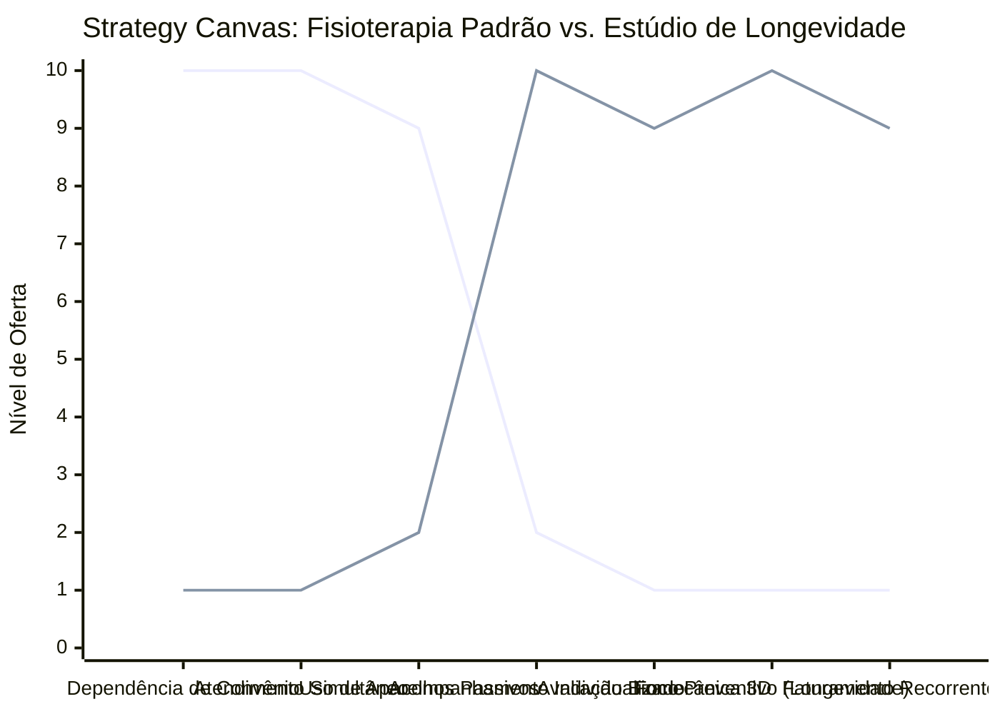

# Estudo de Caso Blue Ocean: Fisioterapia de Longevidade e Performance

## De "Reabilitação de Dor Reativa" para "Estúdio de Longevidade e Biomecânica de Elite"

### 1. O Cenário Atual (Oceano Vermelho)

O mercado tradicional de fisioterapia clínica é altamente dependente de planos de saúde e focado na reatividade:

1. **Gargalo dos Planos de Saúde (Baixa Margem):** Clínicas que atendem por convênio recebem valores irrisórios por sessão, obrigando um único fisioterapeuta a atender de 4 a 6 pacientes simultaneamente.
2. **Abordagem "Choquinho" (Comoditizada):** Uso excessivo de aparelhos passivos (TENS, ultrassom, compressas quentes) que exigem pouca atenção do profissional e geram baixa percepção de valor.
3. **Tratamento Reativo e Finitude:** O paciente só procura a clínica quando sente dor aguda e interrompe o tratamento assim que a dor cessa, gerando altíssima rotatividade de clientes e receita instável.

### 2. A Estratégia do Oceano Azul: "Longevidade e Biomecânica de Elite"

A estratégia propõe desvincular a fisioterapia da imagem de "doença/lesão" e reposicioná-la como um serviço de alta performance, prevenção e otimização da longevidade física.

**A Nova Proposta de Valor:**

- **Foco:** Praticantes de esportes (corrida, triatlo, tênis, escalada) de alta renda e executivos focados em longevidade ativa que desejam evitar lesões e performar no auge de seu potencial físico.
- **Ambiente:** Estúdio boutique moderno, sem equipamentos hospitalares frios, com design acolhedor, som ambiente agradável e atendimento estritamente individualizado (1 para 1).
- **Modelo de Negócio:** Mensalidades ou planos anuais recorrentes de manutenção preventiva (Ex: 1 ou 2 sessões semanais de biomecânica/prevenção), com tickets elevados (R$ 800 a R$ 2.500/mês).

### 3. Strategy Canvas (Tela Estratégica)

O gráfico compara a clínica de convênio padrão com o novo modelo de estúdio focado em longevidade e performance.

**Legenda:**

- **Linha 1:** Clínica de Fisioterapia Tradicional
- **Linha 2:** Estúdio de Longevidade (Blue Ocean)

> **Nota:** O Estúdio de Longevidade elimina a dependência de planos de saúde e o atendimento compartilhado, focando inteiramente no acompanhamento individualizado de longo prazo e na biomecânica avançada para atletas e executivos.

### 4. Framework das Quatro Ações (ERRC Grid)

| Ação         | O que fazer                                                                                                                                                                                                            |
| :----------- | :--------------------------------------------------------------------------------------------------------------------------------------------------------------------------------------------------------------------- |
| **ELIMINAR** | **Atendimento por planos de saúde:** Transição 100% para o modelo particular e de alto valor. **Tratamentos passivos ineficientes:** Reduzir drasticamente o uso de aparelhos de fisioterapia clássicos.            |
| **REDUZIR**  | **Rotatividade de pacientes:** Parar de dar "alta" definitiva e focar em planos de manutenção contínua. **Aparência clínica/hospitalar:** Remover a decoração branca, fria e intimidadora dos consultórios.         |
| **AUMENTAR** | **Individualização:** Garantir que o profissional atenda apenas um cliente por hora. **Prevenção Ativa:** Unir fisioterapia com técnicas avançadas de musculação terapêutica e quiropraxia.                      |
| **CRIAR**    | **Planos de Assinatura Preventivos:** Contratos anuais focados na manutenção da saúde articular e ganho de longevidade física. **Análise Biomecânica de Elite:** Relatórios periódicos de equilíbrio muscular e postura por imagem 3D. |

### 5. Conclusão

Sair da reabilitação da dor e entrar na gestão da performance e da longevidade. O cliente de alto poder aquisitivo entende que manter a integridade de suas articulações e sua mobilidade é um investimento crucial para seu futuro. Ao estruturar uma recorrência mensal de cuidados preventivos, a clínica atinge estabilidade de caixa incomparável, eliminando glosas de convênios e construindo uma base de clientes extremamente fiéis.

### 6. Veja Também (Outros Estudos de Caso)

- [Personal Trainer](./personal-trainer.md)
- [Estúdio de Yoga](./estudio-de-yoga.md)
- [Academia de Escalada](./academia-de-escalada.md)
- [BPO Financeiro e Contabilidade Consultiva](./bpo-financeiro-e-contabilidade.md)
- [Mentoria Premium e Educação de Elite](./mentoria-premium-e-educacao.md)
- [Clínica de Estética](./clinica-de-estetica.md)
- [Odontologia](./odontologia.md)
- [Pousadas e Campings](./pousadas-e-campings.md)
- [Turismo de Compras Têxtil](./turismo-compras-textil.md)
- [Startup B2B SaaS](./startup-b2b-saas.md)
