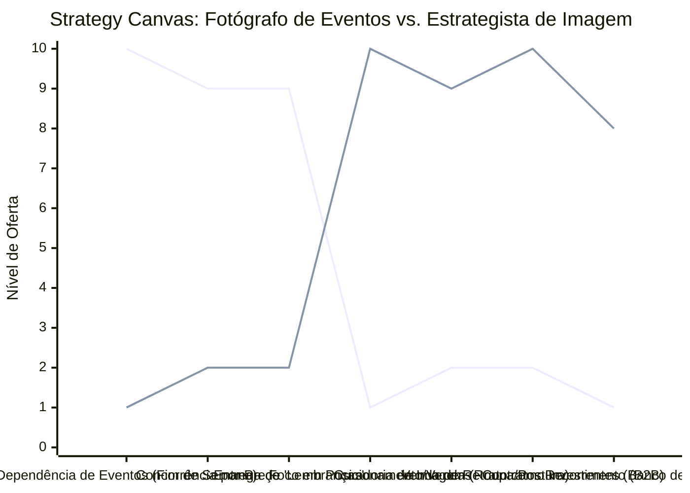

# Estudo de Caso Blue Ocean: Fotografia

## Do "Fotógrafo de Casamento" para o "Estrategista de Imagem Profissional"

### 1. O Cenário Atual (Oceano Vermelho)

O mercado da fotografia tradicional está saturado e enfrenta desafios devido à popularização dos smartphones:

1. **Guerra de Preços em Eventos:** Alta concorrência no nicho de casamentos e festas infantis, com clientes pechinchando pacotes e exigindo a entrega de todas as fotos.
2. **Equipamento como Diferencial:** Profissionais tentando se destacar apenas dizendo que usam câmeras caras, o que não reflete valor claro para o cliente leigo.
3. **Fotografia como "Gasto":** O cliente final enxerga o ensaio apenas como uma lembrança ou luxo, dificultando a cobrança de tickets muito altos (exceto na altíssima renda).

### 2. A Estratégia do Oceano Azul: "Estrategista de Imagem Profissional"

A estratégia propõe migrar do nicho de "eventos e lembranças" para a fotografia comercial focada em construir a autoridade e alavancar os negócios de outros profissionais (Personal Branding).

**A Nova Proposta de Valor:**

- **Foco:** Empreendedores, médicos, advogados, corretores e consultores que precisam transmitir autoridade nas redes sociais para venderem mais caros os seus próprios serviços.
- **Ambiente:** Estúdio corporativo moderno, locações estratégicas (clínicas, escritórios) com curadoria de roupas e postura.
- **Modelo de Negócio:** A foto deixa de ser "lembrança" para ser "ferramenta de vendas". O serviço engloba direção de imagem, paleta de cores e banco de imagens anual para redes sociais.

### 3. Strategy Canvas (Tela Estratégica)

Comparativo entre o fotógrafo de eventos e o estrategista de imagem focado em negócios.

**Legenda:**

- **Linha 1:** Fotógrafo de Eventos Tradicional
- **Linha 2:** Estrategista de Imagem / Retrato Corporativo (Blue Ocean)

### 4. Framework das Quatro Ações (ERRC Grid)

| Ação         | O que fazer                                                                                                                                                                                                                                        |
| :----------- | :------------------------------------------------------------------------------------------------------------------------------------------------------------------------------------------------------------------------------------------------- |
| **ELIMINAR** | **O trabalho aos finais de semana:** Focar em atender profissionais no horário comercial (segunda a sexta). **Guerra de orçamentos de casamentos:** Sair das plataformas genéricas de eventos.                                                  |
| **REDUZIR**  | **Foco extremo no equipamento:** Parar de vender "megapixels" e começar a vender a "mensagem que a foto transmite". **Tempo de edição massiva:** Ensaios corporativos exigem menos fotos entregues, porém de maior impacto, do que uma festa. |
| **AUMENTAR** | **Direção de Pessoas:** Focar em deixar clientes que não são modelos relaxados e com postura de autoridade na frente da câmera. **Ticket Médio:** Aumentar o preço, já que o cliente B2B recupera esse investimento em vendas próprias.         |
| **CRIAR**    | **Consultoria de Posicionamento:** Ajudar o cliente a definir quais roupas e expressões usar para atrair o público alvo correto. **Pacotes Recorrentes:** Criar planos trimestrais ou anuais de renovação de banco de imagens para Instagram.   |

### 5. Conclusão

Sair da "fotografia como custo de evento" para a "fotografia como investimento em marketing pessoal". Ao ajudar médicos ou advogados a parecerem mais caros e confiáveis, o fotógrafo justifica honorários muito mais altos. Além disso, melhora a própria qualidade de vida, trocando as exaustivas madrugadas de sábado por ensaios estratégicos nas terças à tarde, abrindo a possibilidade de assinaturas de conteúdo visual recorrente.

### 6. Veja Também (Outros Estudos de Caso)

- [Odontologia](./odontologia.md)
- [Escritório de Advocacia](./escritorio-advocacia.md)
- [Turismo de Compras Têxtil](./turismo-compras-textil.md)
- [Pousadas e Campings](./pousadas-e-campings.md)
- [Academia de Escalada](./academia-de-escalada.md)
- [Personal Trainer](./personal-trainer.md)
- [Consultoria Empreendedora](./consultoria-empreendedora.md)
- [Agência de Marketing](./agencia-marketing.md)
- [Barbearia](./barbearia.md)
- [Clínica de Estética](./estetica-e-beleza.md)
- [Pet Shop](./pet-shop.md)
- [Cafeteria](./cafeteria.md)
- [Oficina Mecânica](./oficina-mecanica.md)
- [Escola de Idiomas](./escola-idiomas.md)
- [Startup B2B SaaS](./startup-saas.md)
- [Food Truck e Comida de Rua](./food-truck.md)
- [Delivery de Comida Saudável](./delivery-saudavel.md)
- [Loja de Roupas](./loja-roupas.md)
- [Estúdio de Yoga](./estudio-yoga.md)
- [Coworking de Nicho](./coworking.md)
- [Imobiliária Consultiva](./imobiliaria.md)
