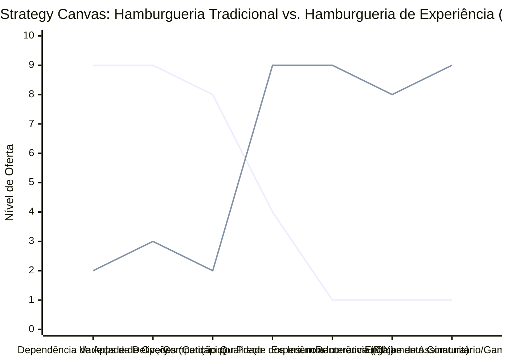

# Estudo de Caso Blue Ocean: Hamburgueria Artesanal

## De "Guerra de Combos e Delivery" para "Hamburgueria DIY e Experiência de Cozinha Coletiva"

### 1. O Cenário Atual (Oceano Vermelho)

O mercado tradicional de hamburguerias artesanais é marcado por extrema concorrência e custos elevados:

1. **Guerra de Combos e Descontos:** Competição feroz por preço e combos promocionais de baixo valor para tentar atrair clientes locais.
2. **Dependência Absoluta de Terceiros (iFood/Rappi):** Alta dependência de aplicativos de delivery de terceiros, que cobram taxas abusivas (até 30% do faturamento), corroendo as margens de lucro.
3. **Cardápios Extensos e Desperdício:** Oferta excessiva de variações de lanches para agradar a todos, o que gera complexidade operacional na cozinha, maior desperdício de insumos e tempo de espera elevado.
4. **Comoditização Física:** Ambientes padronizados (estilo industrial escuro) competindo diretamente com grandes redes de fast-food pelo mesmo público de consumo rápido.

### 2. A Estratégia do Oceano Azul: "Kit DIY e Cozinha de Experiência"

A estratégia propõe tirar o negócio da dependência de entregas rápidas de comida pronta e transformá-lo em uma marca de entretenimento gastronômico em casa (Kits DIY) e experiências interativas presenciais (workshops e eventos).

**A Nova Proposta de Valor:**

- **Foco:** Famílias, grupos de amigos e casais que buscam uma atividade de lazer interativa, transformando o ato de comer hambúrguer em um ritual social.
- **Ambiente:** Canal direto (App próprio com gamificação) para pedidos dos kits e espaços físicos voltados a workshops e degustações fechadas.
- **Modelo de Negócio:** Venda de "Kits DIY" (ingredientes porcionados a vácuo, carnes exclusivas frescas, pão artesanal do dia e molhos secretos) com altíssima margem, além de assinaturas mensais ("Clube do Burguer") e workshops corporativos.

### 3. Strategy Canvas (Tela Estratégica)

Comparativo entre a hamburgueria artesanal de massa (focada em delivery rápido de lanche pronto) e o modelo de hamburgueria DIY e experiência coletiva.

**Legenda:**

- **Linha 1:** Hamburgueria Tradicional
- **Linha 2:** Hamburgueria de Experiência / DIY (Blue Ocean)

> **Nota:** O modelo DIY reduz drasticamente a Dependência de Apps de terceiros e a complexidade do cardápio, permitindo focar em ingredientes de altíssima qualidade e criar novas linhas de receita baseadas em Experiência Interativa e Assinaturas.

### 4. Framework das Quatro Ações (ERRC Grid)

| Ação         | O que fazer                                                                                                                                                                                                            |
| :----------- | :--------------------------------------------------------------------------------------------------------------------------------------------------------------------------------------------------------------------- |
| **ELIMINAR** | **Parceria exclusiva com iFood/Rappi:** Focar em canal próprio para vendas de alto valor. **Cardápios gigantescos:** Cortar opções redundantes que geram desperdício de ingredientes.                               |
| **REDUZIR**  | **Tempo de montagem/cozinha presencial:** Ao focar em kits DIY e eventos fechados, a estrutura de staff na cozinha presencial é reduzida. **Guerra de descontos:** Cessar promoções agressivas que prejudicam a margem. |
| **AUMENTAR** | **Insumos Locais e Curadoria:** Oferecer blend de carnes nobres certificadas e molhos de fabricação própria. **Experiência Visual:** Embalagens premium explicativas que ensinam o cliente a chapear o hambúrguer perfeito. |
| **CRIAR**    | **Kits DIY (Do It Yourself):** Ingredientes embalados a vácuo para o cliente finalizar o lanche em casa, perfeito para eventos familiares. **Clube do Burguer (Assinatura):** Envio mensal de kits temáticos. **Workshops de Chapa:** Eventos corporativos e de networking onde os clientes aprendem a fazer seus próprios lanches. |

### 5. Conclusão

Sair da competição direta com o fast-food e os milhares de lanches no delivery tradicional. Ao vender o kit de preparo (DIY) e a experiência de se tornar um "chef hamburgueiro" por uma noite, o negócio atinge um público de maior poder aquisitivo que valoriza o lazer doméstico de qualidade. A margem de lucro cresce consideravelmente com a eliminação das taxas abusivas dos aplicativos de entrega e a simplificação extrema do cardápio operacional.

### 6. Veja Também (Outros Estudos de Caso)

- [Padaria Artesanal](./padaria-artesanal.md)
- [Delivery de Comida Saudável](./delivery-de-comida-saudavel.md)
- [Food Truck e Comida de Rua](./food-truck.md)
- [Cafeteria](./cafeteria.md)
- [Turismo de Compras Têxtil](./turismo-compras-textil.md)
- [Pousadas e Campings](./pousadas-e-campings.md)
- [Academia de Escalada](./academia-de-escalada.md)
- [Personal Trainer](./personal-trainer.md)
- [Consultoria Empreendedora](./consultoria-empreendedora.md)
- [Agência de Marketing](./agencia-de-marketing.md)
- [Barbearia](./barbearia.md)
- [Clínica de Estética](./clinica-de-estetica.md)
- [Pet Shop](./pet-shop.md)
- [Estúdio de Yoga](./estudio-de-yoga.md)
- [Coworking de Nicho](./coworking-de-nicho.md)
- [Imobiliária Consultiva](./imobiliaria-consultiva.md)
