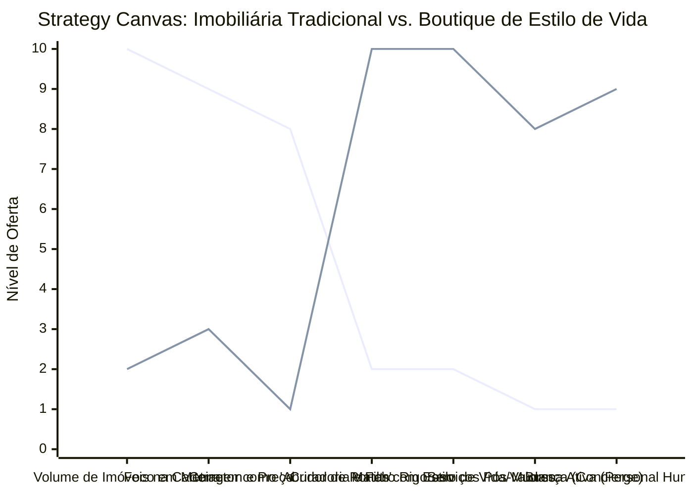

# Estudo de Caso Blue Ocean: Imobiliária

## De "Venda de Tijolos" para "Consultoria de Estilo de Vida"

### 1. O Cenário Atual (Oceano Vermelho)

O mercado imobiliário tradicional é altamente saturado e transacional, focado unicamente na venda da propriedade:

1. **Comoditização de Portais:** O cliente encontra o imóvel sozinho na internet, tornando o corretor apenas um "abridor de portas".
2. **Abordagem Generalista:** Agências com milhares de imóveis desconexos na carteira, sem especialização, atirando para todos os lados.
3. **Foco no "Tijolo":** As vendas são baseadas em metros quadrados, número de quartos e preço, ignorando as reais dores e mudanças de vida do comprador.

### 2. A Estratégia do Oceano Azul: "Boutique de Estilo de Vida"

A estratégia propõe sair do mercado transacional (compra/venda de casas) e entrar no mercado de curadoria de estilo de vida, nichando fortemente o tipo de propriedade e de cliente.

**A Nova Proposta de Valor:**

- **Foco:** Clientes em momentos de transição de vida específicos (ex: nômades digitais buscando refúgios rurais com internet; famílias buscando ecovilas; idosos buscando condomínios adaptados de alto padrão).
- **Ambiente:** Curadoria extrema. A imobiliária tem poucos imóveis no portfólio, mas todos se encaixam perfeitamente na narrativa do estilo de vida vendido.
- **Modelo de Negócio:** Honorários de consultoria imobiliária baseados em "finding" (buscar o imóvel ideal fora do mercado) além das comissões tradicionais.

### 3. Strategy Canvas (Tela Estratégica)

Comparativo entre a Imobiliária Tradicional (volume) e a Boutique de Estilo de Vida (curadoria).

**Legenda:**

- **Linha 1:** Imobiliária Tradicional
- **Linha 2:** Boutique Consultiva (Blue Ocean)

### 4. Framework das Quatro Ações (ERRC Grid)

| Ação         | O que fazer                                                                                                                                                                                                                                                        |
| :----------- | :----------------------------------------------------------------------------------------------------------------------------------------------------------------------------------------------------------------------------------------------------------------- |
| **ELIMINAR** | **Carteiras gigantescas e genéricas:** Parar de captar qualquer imóvel apenas para fazer volume no site. **Anúncios frios em portais:** Reduzir a dependência de plataformas onde a única competição é o preço.                                                 |
| **REDUZIR**  | **Visitas desqualificadas:** Diminuir drasticamente as visitas presenciais usando tours virtuais 3D hiper-realistas na fase inicial. **Foco técnico ("tijolo"):** Falar menos sobre o acabamento e mais sobre o dia a dia da região.                          |
| **AUMENTAR** | **Entrevista Diagnóstica:** Mapear profundamente a rotina, hobbies e valores da família antes de apresentar qualquer opção. **Marketing de Conteúdo de Bairro:** Mostrar como é viver no local (escolas, feiras, cafés, trânsito).                            |
| **CRIAR**    | **Serviço de "Property Hunter":** O cliente contrata a agência para encontrar o imóvel perfeito, mesmo que não esteja à venda. **Concierge Pós-Mudança:** Ajuda na transição de vida (matrícula na escola, indicação de arquitetos, médicos locais, clubes). |

### 5. Conclusão

A transição de "corretor de imóveis" para "Property Hunter" ou "Consultor de Transição de Vida" elimina a concorrência dos grandes portais de classificados. O cliente não busca a agência porque ela tem a maior lista de casas, mas porque ela é a única que entende exatamente o estilo de vida que ele deseja alcançar. Isso fideliza clientes de alto padrão, justifica honorários exclusivos e gera indicações valiosas.

### 6. Veja Também (Outros Estudos de Caso)

- [Turismo de Compras Têxtil](./turismo-compras-textil.md)
- [Pousadas e Campings](./pousadas-e-campings.md)
- [Academia de Escalada](./academia-de-escalada.md)
- [Personal Trainer](./personal-trainer.md)
- [Consultoria Empreendedora](./consultoria-empreendedora.md)
- [Agência de Marketing](./agencia-marketing.md)
- [Barbearia](./barbearia.md)
- [Clínica de Estética](./estetica-e-beleza.md)
- [Pet Shop](./pet-shop.md)
- [Cafeteria](./cafeteria.md)
- [Oficina Mecânica](./oficina-mecanica.md)
- [Escola de Idiomas](./escola-idiomas.md)
- [Startup B2B SaaS](./startup-saas.md)
- [Food Truck e Comida de Rua](./food-truck.md)
- [Delivery de Comida Saudável](./delivery-saudavel.md)
- [Loja de Roupas](./loja-roupas.md)
- [Estúdio de Yoga](./estudio-yoga.md)
- [Coworking de Nicho](./coworking.md)
