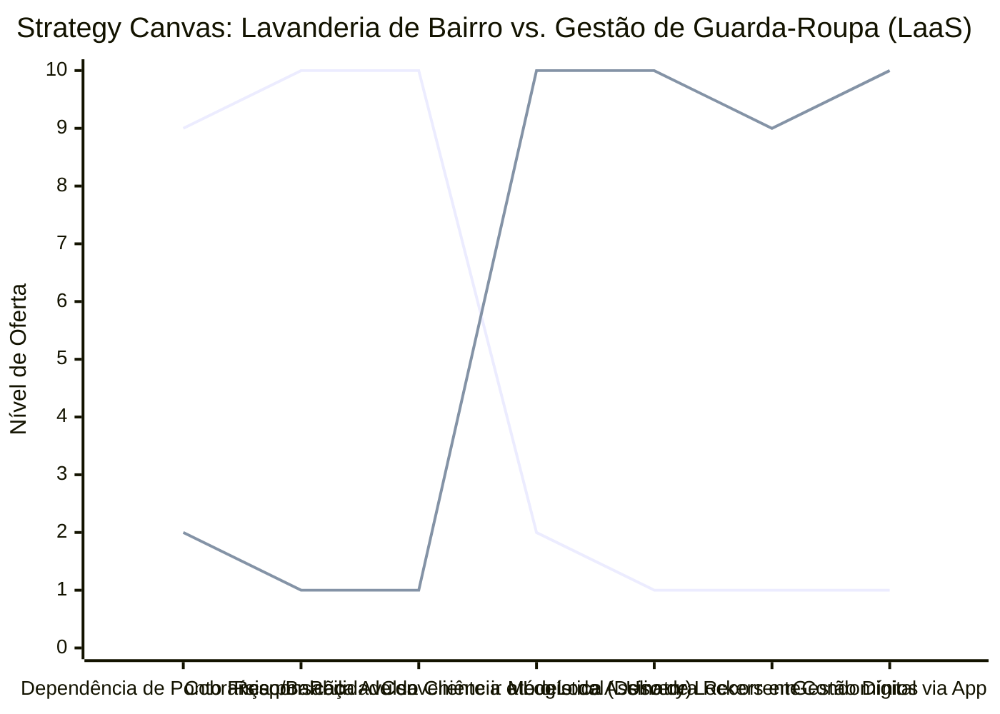

# Estudo de Caso Blue Ocean: Lavanderia

## Do "Comércio Local de Roupas Sujas" para "Serviço de Gestão de Guarda-Roupa"

### 1. O Cenário Atual (Oceano Vermelho)

O mercado de lavanderias de bairro e franquias tradicionais sofre com margens apertadas e dependência do fluxo de rua:

1. **Serviço Reativo:** O cliente só leva as roupas quando a situação está crítica ou para lavar itens muito grandes (edredons), o que gera um fluxo de caixa irregular.
2. **Competição por Preço (Peça por Peça):** O foco é vender lavagem e passadoria por peça, entrando em guerra de preços com outras lavanderias da região ou com as máquinas domésticas.
3. **Logística Ineficiente:** O cliente precisa ir fisicamente ao local, o que afasta o público jovem e ocupado que preza pela conveniência extrema.

### 2. A Estratégia do Oceano Azul: "Gestão de Guarda-Roupa e Assinatura"

A estratégia transforma a lavanderia de um "ponto comercial físico para lavagem avulsa" em um serviço tecnológico de gestão do vestuário (Laundry as a Service - LaaS), voltado para assinatura.

**A Nova Proposta de Valor:**

- **Foco:** Profissionais solteiros, executivos e jovens casais de classe média/alta que não têm tempo (ou não querem) perder horas de final de semana lavando e passando roupas.
- **Ambiente:** Aplicativo focado na experiência do usuário, "lockers" (armários inteligentes) em condomínios e logística invisível.
- **Modelo de Negócio:** Planos mensais de assinatura (Ex: Cesto Semanal), com coleta e entrega em domicílio, garantindo previsibilidade de faturamento.

### 3. Strategy Canvas (Tela Estratégica)

Comparativo entre a lavanderia tradicional com cobrança por peça e o serviço por assinatura digital.

**Legenda:**

- **Linha 1:** Lavanderia Tradicional
- **Linha 2:** Gestão de Guarda-Roupa / LaaS (Blue Ocean)

### 4. Framework das Quatro Ações (ERRC Grid)

| Ação         | O que fazer                                                                                                                                                                                                          |
| :----------- | :------------------------------------------------------------------------------------------------------------------------------------------------------------------------------------------------------------------- |
| **ELIMINAR** | **O Balcão de Atendimento Físico:** Eliminar a dependência de um ponto comercial caro na rua principal; a operação pode ir para um galpão mais barato. **Preços complexos:** Tabela com dezenas de preços por peça de roupa. |
| **REDUZIR**  | **Atrito para o Cliente:** Reduzir o esforço do cliente para ter a roupa limpa. **Irregularidade Financeira:** Diminuir a sazonalidade e imprevisibilidade da receita.                                            |
| **AUMENTAR** | **Conveniência Absoluta:** O "problema da roupa suja" deve desaparecer da vida do cliente. **Previsibilidade (MRR):** Focar em contratos mensais recorrentes para gerar previsibilidade no fluxo de caixa.        |
| **CRIAR**    | **Planos de Assinatura:** Cestas/Bolsas com limite de peso/peças mensais. **Parcerias B2B:** Instalação de armários inteligentes (lockers) em grandes condomínios residenciais e empresariais.                    |

### 5. Conclusão

Vender "tempo" em vez de vender "lavagem de roupas". O modelo por assinatura com delivery automatizado ou lockers retira a fricção da transação. A lavanderia otimiza sua operação saindo de pontos comerciais caros para galpões logísticos focados em produtividade, enquanto o cliente paga uma mensalidade previsível para se livrar de uma das tarefas domésticas mais odiadas.

### 6. Veja Também (Outros Estudos de Caso)

- [Fotografia](./fotografia.md)
- [Odontologia](./odontologia.md)
- [Escritório de Advocacia](./escritorio-advocacia.md)
- [Turismo de Compras Têxtil](./turismo-compras-textil.md)
- [Pousadas e Campings](./pousadas-e-campings.md)
- [Academia de Escalada](./academia-de-escalada.md)
- [Personal Trainer](./personal-trainer.md)
- [Consultoria Empreendedora](./consultoria-empreendedora.md)
- [Agência de Marketing](./agencia-marketing.md)
- [Barbearia](./barbearia.md)
- [Clínica de Estética](./estetica-e-beleza.md)
- [Pet Shop](./pet-shop.md)
- [Cafeteria](./cafeteria.md)
- [Oficina Mecânica](./oficina-mecanica.md)
- [Escola de Idiomas](./escola-idiomas.md)
- [Startup B2B SaaS](./startup-saas.md)
- [Food Truck e Comida de Rua](./food-truck.md)
- [Delivery de Comida Saudável](./delivery-saudavel.md)
- [Loja de Roupas](./loja-roupas.md)
- [Estúdio de Yoga](./estudio-yoga.md)
- [Coworking de Nicho](./coworking.md)
- [Imobiliária Consultiva](./imobiliaria.md)
