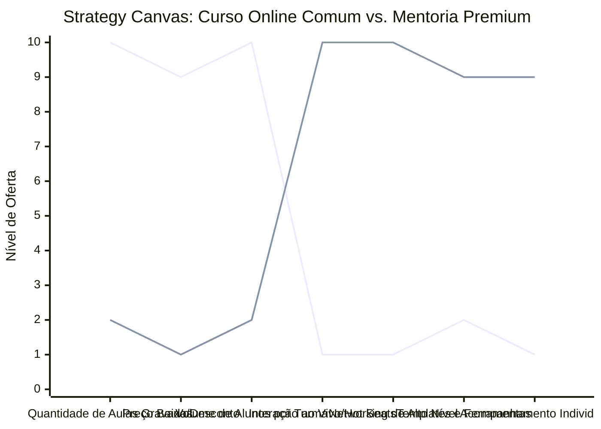

# Estudo de Caso Blue Ocean: Mentoria Premium e Educação de Elite

## De "Infoproduto de Volume" para "Experiência de Transformação de Alto Valor"

### 1. O Cenário Atual (Oceano Vermelho)

O mercado de infoprodutos e cursos online tradicionais encontra-se saturado e desgastado:

1. **Guerra de Preços e Descontos:** Cursos gravados vendidos em plataformas de massa por preços irrisórios (ex: R$ 29 a R$ 97) ou lançamentos agressivos com promessas exageradas.
2. **Abandono Quase Total:** Taxas de conclusão de cursos gravados abaixo de 5%. O aluno compra por impulso, mas nunca assiste às aulas.
3. **Conteúdo Genérico ("Lero-Lero"):** Excesso de teoria, falta de suporte individualizado e ausência de ferramentas práticas aplicáveis ao negócio do cliente.

### 2. A Estratégia do Oceano Azul: "Mentoria Premium e Coorte"

A estratégia propõe sair da venda de "videoaulas gravadas e passivas" para uma experiência de aprendizado ativa, híbrida e de alto impacto (Cohort-Based Program), focando em acompanhamento e geração de resultados reais.

**A Nova Proposta de Valor:**

- **Foco:** Empreendedores e profissionais consolidados que não têm tempo a perder assistindo a dezenas de horas de vídeos genéricos e exigem soluções diretas para seus desafios reais de negócios.
- **Ambiente:** Encontros ao vivo e interativos via videoconferência, comunidade seleta de alta colaboração (networking) e frameworks práticos imediatamente aplicáveis.
- **Modelo de Negócio:** Auto-ticket (High-Ticket) variando de R$ 3.000 a R$ 15.000 por participante, operado em turmas fechadas (coortes) com alta escassez e exclusividade.

### 3. Strategy Canvas (Tela Estratégica)

O gráfico ilustra o contraste entre o modelo de curso gravado em massa e a mentoria premium interativa.

**Legenda:**

- **Linha 1:** Curso Online Comum
- **Linha 2:** Mentoria Premium (Blue Ocean)

> **Nota:** A Mentoria Premium elimina o excesso de aulas gravadas exaustivas e o foco em volume para priorizar a interação direta, o networking e as ferramentas práticas que geram retorno financeiro rápido.

### 4. Framework das Quatro Ações (ERRC Grid)

| Ação         | O que fazer                                                                                                                                                                                                            |
| :----------- | :--------------------------------------------------------------------------------------------------------------------------------------------------------------------------------------------------------------------- |
| **ELIMINAR** | **Gravações intermináveis de slides:** Acabar com os cursos com mais de 100 aulas teóricas e repetitivas. **Promessas de enriquecimento rápido:** Eliminar o marketing agressivo de ostentação e focar em negócios. |
| **REDUZIR**  | **Tamanho da turma:** Reduzir o número de alunos para garantir atenção individualizada a cada um. **Sais operacionais de suporte:** Diminuir respostas automáticas de suporte e substituí-las por feedback de especialistas. |
| **AUMENTAR** | **Interação Direta (Hot Seats):** Sessões de mentoria ao vivo onde os negócios dos alunos são auditados e corrigidos pelo mentor. **Foco em Unit Economics:** Priorizar a melhoria dos processos comerciais do aluno.   |
| **CRIAR**    | **Modelos e Templates Prontos:** Entregar ferramentas prontas, planilhas inteligentes e copilotos de inteligência artificial para agilizar o trabalho do aluno. **Comunidade de Responsabilidade (Accountability):** Grupos de foco para cobrança mútua de metas. |

### 5. Conclusão

Parar de vender informação e passar a vender transformação e implementação acompanhada. Em um mundo onde o conteúdo é abundante e gratuito, o valor mudou para a curadoria, personalização e direcionamento. A mentoria premium não compete no oceano vermelho dos cursos de R$ 97; ela atrai o cliente ideal que busca economizar tempo e obter resultados imediatos e comprovados.

### 6. Veja Também (Outros Estudos de Caso)

- [Consultoria Empreendedora](./consultoria-empreendedora.md)
- [BPO Financeiro e Contabilidade Consultiva](./bpo-financeiro-e-contabilidade.md)
- [Fisioterapia de Longevidade e Performance](./fisioterapia-e-longevidade.md)
- [Agência de Marketing](./agencia-de-marketing.md)
- [Startup B2B SaaS](./startup-b2b-saas.md)
- [Turismo de Compras Têxtil](./turismo-compras-textil.md)
- [Pousadas e Campings](./pousadas-e-campings.md)
- [Academia de Escalada](./academia-de-escalada.md)
- [Personal Trainer](./personal-trainer.md)
- [Coworking de Nicho](./coworking-de-nicho.md)
- [Imobiliária Consultiva](./imobiliaria-consultiva.md)
