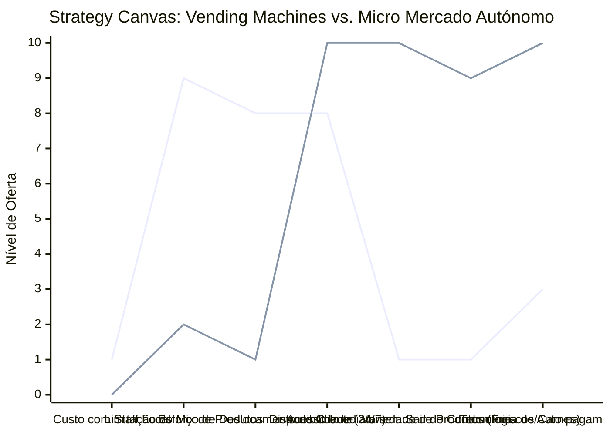

# Estudo de Caso Blue Ocean: Micro Mercado Autónomo

## De "Vending Machines" para "Mercado de Conveniência e Confiança 100% Autónomo"

### 1. O Cenário Atual (Oceano Vermelho)

O varejo de conveniência de proximidade tradicional em condomínios e empresas disputa pequenas margens em formatos limitados:

1. **Vending Machines Limitadas:** Máquinas pequenas que vendem apenas refrigerantes e biscoitos, com alta taxa de falha de entrega física (produtos presos) e mix de produtos extremamente limitado.
2. **Dependência de Lojas Físicas de Posto (AMPM):** Exige que o cliente saia de casa de carro durante a noite ou fins de semana para fazer compras simples, enfrentando insegurança e desperdiçando tempo.
3. **Alto Custo de Operação Física:** Supermercados tradicionais exigem equipe constante de caixa, reposição presencial em tempo integral, segurança física e aluguel comercial caro.
4. **Competição de Preço em Mercados de Bairro:** Comércios pequenos competindo diretamente com atacados, incapazes de oferecer preços baixos ou conveniência imediata em horários alternativos.

### 2. A Estratégia do Oceano Azul: "Mercado Autónomo de Confiança"

A estratégia propõe a instalação de lojas físicas integradas em condomínios residenciais ou empresariais baseadas no conceito de "Honesty Market" (Mercado de Confiança), operando 24 horas por dia, 7 dias por semana, sem nenhum funcionário no local.

**A Nova Proposta de Valor:**

- **Foco:** Famílias e profissionais em condomínios fechados de médio/alto padrão que valorizam a conveniência absoluta de ter um mix completo de supermercado (incluindo congelados, hortifrúti fresco, carnes nobres e bebidas geladas) a poucos passos do elevador.
- **Ambiente:** Loja física compacta, de design moderno e limpo, sem catracas físicas agressivas, usando câmeras inteligentes e auto-pagamento (Self-Checkout) via app ou terminal de pagamento.
- **Modelo de Negócio:** Custo de operação baixíssimo (sem funcionários locais) e receita recorrente com margens saudáveis devido à comodidade premium. Logística centralizada de abastecimento inteligente controlada por software.

### 3. Strategy Canvas (Tela Estratégica)

O gráfico compara a vending machine tradicional e a loja de conveniência de posto com o novo modelo de mercado autónomo instalado dentro dos condomínios.

**Legenda:**

- **Linha 1:** Vending Machine / Conveniência de Posto Tradicional
- **Linha 2:** Micro Mercado Autónomo (Blue Ocean)

> **Nota:** O Micro Mercado Autónomo elimina custos operacionais com funcionários locais e reduz a limitação de produtos, focando em conveniência máxima 24/7 de forma integrada ao lar do cliente.

### 4. Framework das Quatro Ações (ERRC Grid)

| Ação         | O que fazer                                                                                                                                                                                                            |
| :----------- | :--------------------------------------------------------------------------------------------------------------------------------------------------------------------------------------------------------------------- |
| **ELIMINAR** | **Staff de caixa local:** Toda a operação financeira e transações são feitas pelo próprio cliente via Self-Checkout ou app. **Aluguel comercial caro:** Instalação em áreas comuns cedidas pelos condomínios.       |
| **REDUZIR**  | **Furtos por barreiras físicas:** Substituir grades de segurança ou trancas de aço complexas por um ambiente aberto baseado na confiança mútua e monitoramento discreto por câmeras.                                  |
| **AUMENTAR** | **Conveniência de Horário (24/7):** Garantir que a loja esteja sempre acessível a qualquer hora da noite ou finais de semana. **Mix de Produtos Premium:** Oferecer itens para jantares de emergência e churrascos.  |
| **CRIAR**    | **Modelo 'Honesty Market':** Criar uma cultura de condomínio baseada na confiança mútua e engajamento da vizinhança. **Abastecimento Inteligente:** Software que avisa a central quando determinados itens estão perto do fim. |

### 5. Conclusão

Romper com as barreiras tradicionais do varejo de rua e instalar o comércio dentro do lar do consumidor. O Micro Mercado Autónomo elimina custos fixos colossais de funcionários e infraestrutura urbana complexa, ao mesmo tempo que entrega ao cliente o maior nível de conveniência possível. O morador não está comprando apenas um refrigerante, está comprando a segurança e o conforto de não ter de sair de seu condomínio à noite, justificando excelentes margens operacionais de vendas.

### 6. Veja Também (Outros Estudos de Caso)

- [Mercado de Bairro](./mercado-de-bairro.md)
- [Agência de Automação de IA](./agencia-de-automacao-ia.md)
- [BPO Financeiro e Contabilidade Consultiva](./bpo-financeiro-e-contabilidade.md)
- [Startup B2B SaaS](./startup-b2b-saas.md)
- [Hamburgueria Artesanal](./hamburgueria-artesanal.md)
- [Padaria Artesanal](./padaria-artesanal.md)
- [Turismo de Compras Têxtil](./turismo-compras-textil.md)
- [Pousadas e Campings](./pousadas-e-campings.md)
- [Academia de Escalada](./academia-de-escalada.md)
- [Personal Trainer](./personal-trainer.md)
- [Agência de Marketing](./agencia-de-marketing.md)
- [Barbearia](./barbearia.md)
- [Clínica de Estética](./clinica-de-estetica.md)
- [Pet Shop](./pet-shop.md)
- [Cafeteria](./cafeteria.md)
- [Oficina Mecânica](./oficina-mecanica.md)
- [Escola de Idiomas](./escola-de-idiomas.md)
- [Food Truck e Comida de Rua](./food-truck.md)
- [Delivery de Comida Saudável](./delivery-de-comida-saudavel.md)
- [Loja de Roupas](./loja-de-roupas.md)
- [Estúdio de Yoga](./estudio-de-yoga.md)
- [Coworking de Nicho](./coworking-de-nicho.md)
- [Imobiliária Consultiva](./imobiliaria-consultiva.md)
