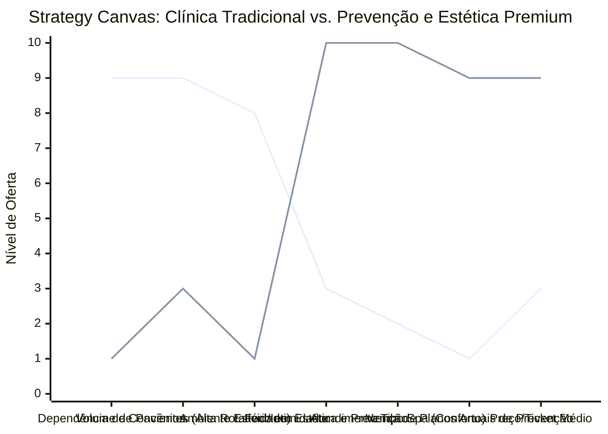

# Estudo de Caso Blue Ocean: Odontologia

## Da "Odontologia de Dor e Curativa" para a "Clínica de Prevenção e Estética Premium"

### 1. O Cenário Atual (Oceano Vermelho)

O mercado odontológico é focado amplamente em combater problemas bucais já estabelecidos, muitas vezes operando em uma guerra de preços através de convênios:

1. **Atendimento Focado na Dor/Problema:** O paciente só procura o dentista quando sente dor (cáries, canal, extração). O foco é curativo.
2. **Dependência de Convênios:** Muitos profissionais são reféns de planos odontológicos que pagam valores irrisórios por procedimento, forçando-os a atender em alto volume para faturar.
3. **Ambiente Clínico Estéril:** Clínicas com o clássico "cheiro de dentista", barulho de motor intimidador e sala de espera fria e ansiosa.

### 2. A Estratégia do Oceano Azul: "Prevenção e Estética Premium"

A estratégia desloca o consultório odontológico de um "local de sofrimento para tratar dor" para um ambiente de "spa odontológico" focado em manutenção preventiva contínua e aprimoramento da auto-estima.

**A Nova Proposta de Valor:**

- **Foco:** Pacientes que valorizam o sorriso como parte fundamental da estética e saúde, preferindo pagar mais para não sentir dor no futuro e para terem dentes perfeitos.
- **Ambiente:** Spa Odontológico. Design sofisticado, aromaterapia, ausência de barulhos irritantes, atendimento acolhedor.
- **Modelo de Negócio:** Descredenciamento de convênios. Foco em planos anuais de profilaxia/prevenção e procedimentos de alto valor agregado (lentes de contato, alinhadores invisíveis, harmonização facial).

### 3. Strategy Canvas (Tela Estratégica)

Comparativo entre a clínica convencional focada em convênios e a clínica estética preventiva premium.

**Legenda:**

- **Linha 1:** Clínica Odontológica Tradicional
- **Linha 2:** Clínica de Prevenção e Estética (Blue Ocean)

### 4. Framework das Quatro Ações (ERRC Grid)

| Ação         | O que fazer                                                                                                                                                                                                                                   |
| :----------- | :-------------------------------------------------------------------------------------------------------------------------------------------------------------------------------------------------------------------------------------------- |
| **ELIMINAR** | **Atendimento por Convênios:** Sair do jogo de volume de baixo custo que desgasta o profissional. **O "Cheiro e Barulho de Dentista":** Eliminar estímulos que causam ansiedade e medo nos pacientes.                                      |
| **REDUZIR**  | **Tempo na Sala de Espera:** Organizar a agenda para atendimento pontual (sem a superlotação gerada por convênios). **Foco no Curativo:** Reduzir a dependência financeira de tratar problemas complexos e dolorosos (canal, extrações).   |
| **AUMENTAR** | **Experiência do Paciente (Conforto):** Oferecer fones com cancelamento de ruído, óculos de VR, massagem, aromaterapia. **Ticket Médio:** Cobrar valores premium justificados pela experiência luxuosa e resultados estéticos superiores.  |
| **CRIAR**    | **Planos Anuais de Prevenção (Recorrência):** Clubes de assinatura onde o paciente paga mensalidade para ir x vezes ao ano fazer limpeza e acompanhamento. **Consultoria Estética Integrada:** Harmonização facial aliada à odontologia. |

### 5. Conclusão

Sair da "esteira de produção" imposta pelos planos odontológicos. Focar no nicho premium que procura experiência, conforto, beleza e prevenção. A clínica ganha recorrência financeira através dos clubes de prevenção, e lucra alto com as intervenções estéticas (alinhadores e lentes de contato dental), enquanto o paciente deixa de ter medo de ir ao dentista.

### 6. Veja Também (Outros Estudos de Caso)

- [Escritório de Advocacia](./escritorio-advocacia.md)
- [Turismo de Compras Têxtil](./turismo-compras-textil.md)
- [Pousadas e Campings](./pousadas-e-campings.md)
- [Academia de Escalada](./academia-de-escalada.md)
- [Personal Trainer](./personal-trainer.md)
- [Consultoria Empreendedora](./consultoria-empreendedora.md)
- [Agência de Marketing](./agencia-marketing.md)
- [Barbearia](./barbearia.md)
- [Clínica de Estética](./estetica-e-beleza.md)
- [Pet Shop](./pet-shop.md)
- [Cafeteria](./cafeteria.md)
- [Oficina Mecânica](./oficina-mecanica.md)
- [Escola de Idiomas](./escola-idiomas.md)
- [Startup B2B SaaS](./startup-saas.md)
- [Food Truck e Comida de Rua](./food-truck.md)
- [Delivery de Comida Saudável](./delivery-saudavel.md)
- [Loja de Roupas](./loja-roupas.md)
- [Estúdio de Yoga](./estudio-yoga.md)
- [Coworking de Nicho](./coworking.md)
- [Imobiliária Consultiva](./imobiliaria.md)
