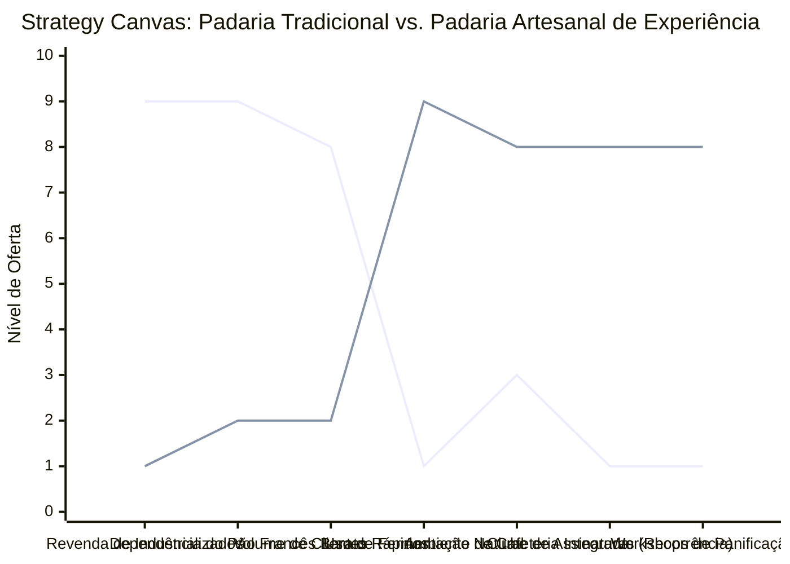

# Estudo de Caso Blue Ocean: Padaria Artesanal

## De "Pão Francês de Balcão" para "Experiência de Panificação e Clube de Assinaturas"

### 1. O Cenário Atual (Oceano Vermelho)

O mercado tradicional de panificação de bairro é marcado pela comoditização e baixa diferenciação:

1. **Competição por Preço e Volume:** Foco absoluto no preço do pão francês clássico e em atrair clientes em massa nos horários de pico (início da manhã e fim de tarde).
2. **Ambiente Transacional Rápido:** Balcões de atendimento barulhentos, filas de espera desconfortáveis e pouca ou nenhuma retenção de relacionamento pós-venda.
3. **Revenda de Produtos Industrializados:** Gôndolas cheias de refrigerantes, salgadinhos e doces industrializados comuns que não agregam valor e ocupam espaço físico valioso da loja.
4. **Dependência de Misturas Prontas:** Uso recorrente de misturas de panificação prontas e aditivos químicos artificiais para acelerar processos de fermentação, reduzindo o valor nutricional e gastronômico do pão.

### 2. A Estratégia do Oceano Azul: "Experiência e Assinatura Artesanal"

A estratégia propõe desvincular o negócio do pão de massa industrializado e reposicioná-lo como um centro de cultura de fermentação natural, integrando uma cafeteria de especialidade com clube de assinatura de pães e workshops de panificação para amadores.

**A Nova Proposta de Valor:**

- **Foco:** Moradores urbanos conscientes, entusiastas da gastronomia de alta qualidade e pessoas que buscam uma alimentação mais saudável e natural, livre de aditivos químicos.
- **Ambiente:** Layout acolhedor (estilo Farm-to-Table), cozinha de panificação visível aos clientes (conceito aquário), café de especialidade com atendimento humanizado.
- **Modelo de Negócio:** Assinatura semanal recorrente de pães e produtos de café da manhã entregues diretamente em domicílio, combinado com a venda de pães de fermentação natural premium, workshops de panificação ("Faça seu próprio Pão") e kits de ingredientes.

### 3. Strategy Canvas (Tela Estratégica)

Comparativo entre a padaria de bairro tradicional (focada em volume e produtos genéricos) e o modelo de padaria artesanal e clube de assinaturas.

**Legenda:**

- **Linha 1:** Padaria Tradicional de Bairro
- **Linha 2:** Padaria Artesanal de Experiência (Blue Ocean)

> **Nota:** A Padaria Artesanal elimina a revenda de itens industriais e a corrida pelo menor preço do pão francês para focar em Fermentação Natural de alta qualidade, Cafeteria Premium, Assinatura Recorrente e Workshops Educacionais.

### 4. Framework das Quatro Ações (ERRC Grid)

| Ação         | O que fazer                                                                                                                                                                                                            |
| :----------- | :--------------------------------------------------------------------------------------------------------------------------------------------------------------------------------------------------------------------- |
| **ELIMINAR** | **Revenda de produtos industriais genéricos:** Retirar refrigerantes e snacks de marcas globais, abrindo espaço para curadorias locais. **Aditivos químicos e misturas prontas:** Utilizar apenas ingredientes puros e naturais. |
| **REDUZIR**  | **Variedade excessiva de itens no balcão:** Focar em um menu compacto de altíssima qualidade de pães artesanais e doces finos sazonais. **Foco na concorrência de preço:** Abandonar a guerra do pão francês. |
| **AUMENTAR** | **Educação do Cliente:** Explicar os benefícios de saúde da fermentação lenta (menor índice glicêmico, melhor digestibilidade). **Margem de Lucro por Unidade:** Oferecer produtos de alto valor agregado com alta qualidade. |
| **CRIAR**    | **Clube de Assinatura de Pão Fresco:** Entrega programada no condomínio ou residência do cliente. **Workshops de Panificação:** Aulas de fins de semana ensinando a cultivar o "levain" (fermento natural). **Kits Padeiro Amador:** Venda de farinhas importadas ou moídas na pedra e ferramentas básicas. |

### 5. Conclusão

Ao focar em **fermentação natural, saúde e comunidade**, a padaria artesanal deixa de ser um ponto comercial dependente de compras por impulso de moedas e se torna um destino gastronômico premium com faturamento recorrente garantido via clube de assinaturas. A eliminação da revenda de industrializados e de dezenas de itens de balcão de baixa margem simplifica a operação e maximiza a rentabilidade de cada metro quadrado.

### 6. Veja Também (Outros Estudos de Caso)

- [Hamburgueria Artesanal](./hamburgueria-artesanal.md)
- [Cafeteria](./cafeteria.md)
- [Delivery de Comida Saudável](./delivery-de-comida-saudavel.md)
- [Food Truck e Comida de Rua](./food-truck.md)
- [Mercado de Bairro](./mercado-de-bairro.md)
- [Turismo de Compras Têxtil](./turismo-compras-textil.md)
- [Pousadas e Campings](./pousadas-e-campings.md)
- [Academia de Escalada](./academia-de-escalada.md)
- [Personal Trainer](./personal-trainer.md)
- [Consultoria Empreendedora](./consultoria-empreendedora.md)
- [Agência de Marketing](./agencia-de-marketing.md)
- [Barbearia](./barbearia.md)
- [Clínica de Estética](./clinica-de-estetica.md)
- [Pet Shop](./pet-shop.md)
- [Estúdio de Yoga](./estudio-de-yoga.md)
- [Coworking de Nicho](./coworking-de-nicho.md)
- [Imobiliária Consultiva](./imobiliaria-consultiva.md)
