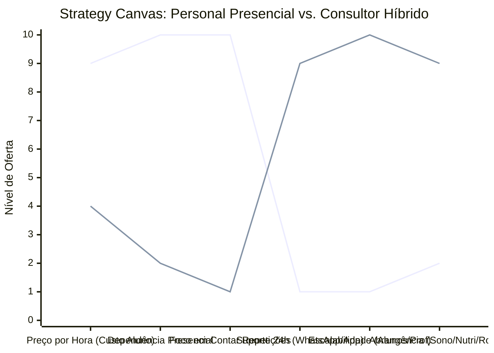

# Estudo de Caso Blue Ocean: Personal Trainer
## Do "Instrutor de Repetições" ao "Arquiteto de Estilo de Vida"

### 1. O Cenário Atual (Oceano Vermelho)

O mercado de Personal Trainer clássico enfrenta uma barreira de crescimento intransponível: o tempo. O profissional vende **horas/aula**.

**Problemas do Modelo Tradicional:**
*   **Teto de Faturamento:** Limitado pelo número de horas no dia.
*   **Geografia:** Preso à academia local e ao deslocamento.
*   **Commodity:** Compete com outros instrutores pelo valor da hora/aula.
*   **Cancelamentos:** Se o aluno falta, o personal não recebe (ou gera atrito para cobrar).

### 2. A Estratégia do Oceano Azul: "Consultoria Híbrida & High-Ticket"

O novo modelo transforma o personal em um **Treinador Híbrido** ou **Consultor de Saúde Integral**. Ele não vende "uma hora de treino", ele vende **resultado e acompanhamento 24/7** (assíncrono).

**A Nova Proposta de Valor:**
*   **Foco:** O resultado final (emagrecimento, performance), não a presença física.
*   **Entrega:** Planilhas via App, análise de vídeos de execução, chamadas de alinhamento quinzenais.
*   **Holístico:** Inclui orientações de sono, hidratação, mentalidade e rotina, não apenas "levantar peso".

### 3. Strategy Canvas (Tela Estratégica)

O gráfico compara o Personal de Chão de Academia (Tradicional) com o Consultor Híbrido Online.

**Legenda:**
*   **Linha 1:** Personal Tradicional (Hora/Aula)
*   **Linha 2:** Consultor Híbrido (Blue Ocean)

> **Nota:** O Consultor Híbrido *elimina* a necessidade de estar fisicamente presente em todos os treinos (o que reduz o custo para o aluno e libera a agenda do professor), mas *aumenta* drasticamente o suporte diário e a abrangência do serviço (cuidando do estilo de vida todo).

### 4. Framework das Quatro Ações (ERRC Grid)

Como escalar sem perder qualidade:

| Ação | O que fazer |
| :--- | :--- |
| **ELIMINAR** | **Venda de hora/aula avulsa:** O modelo é assinatura recorrente (MRR). **Deslocamento físico:** O treino presencial é um "bônus" raro ou inexistente (focado em correção técnica pontual). |
| **REDUZIR** | **Dependência da academia específica:** O aluno treina onde quiser (em casa, no parque, em viagem). **Correção em tempo real:** Substituir por análise de vídeo enviada pelo aluno (feedback mais preciso e pausado). |
| **AUMENTAR** | **Accountability (Cobrança):** Check-ins diários ou semanais para garantir adesão. **Material Educativo:** Vídeos explicativos de execução e aulas teóricas sobre saúde. **Comunidade:** Grupos de desafios entre alunos. |
| **CRIAR** | **Ecossistema Digital:** App próprio ou white-label para prescrição. **Gamificação:** Desafios de 30 dias com prêmios. **Parcerias:** Nutricionista e psicólogo integrados no pacote premium. |

### 5. Conclusão

Ao adotar o modelo híbrido, um personal que antes atendia no máximo 10 alunos por dia (exaustivamente) passa a gerir uma carteira de 50 a 100 alunos com qualidade superior de acompanhamento e liberdade geográfica. O aluno paga menos do que pagaria por 3x/semana presenciais, mas recebe um suporte diário muito mais efetivo para seus objetivos reais. O "Blue Ocean" aqui é a **liberdade** (para o personal) e a **autonomia com suporte** (para o aluno).
