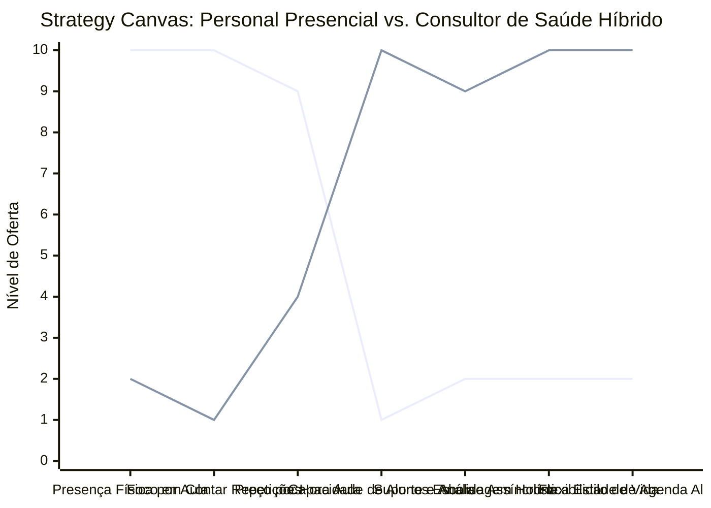

# Estudo de Caso Blue Ocean: Personal Trainer

## De "Vendedor de Horas Presencial" para "Consultor de Saúde Híbrido e Gestor de Rotina"

### 1. O Cenário Atual (Oceano Vermelho)

O mercado de Personal Trainers tradicionais é caracterizado pela severa limitação de faturamento imposta pelas barreiras de tempo e espaço físico:

1. **Venda de Horas (Teto de Faturamento):** O profissional realiza uma troca direta de seu tempo por dinheiro. Se o personal fica doente, viaja ou quer descansar, sua receita cessa imediatamente.
2. **Dependência e Deslocamento Presencial:** Alta dependência de estar presente fisicamente na mesma academia que o aluno, enfrentando trânsito constante entre diferentes pontos da cidade e cancelamentos de última hora de alunos ocupados.
3. **Foco Limitado a Contar Repetições:** A entrega de valor resume-se a acompanhar a execução de exercícios na sala de musculação, papel que aplicativos de celular ou instrutores de salão tentam substituir.
4. **Falta de Acompanhamento Holístico:** O personal não possui controle ou visibilidade sobre as outras 23 horas do dia do aluno (sono, estresse, alimentação, hábitos diários), limitando a eficácia dos resultados do treino.

### 2. A Estratégia do Oceano Azul: "Consultor de Saúde Híbrido"

A estratégia propõe desvincular o profissional do modelo puramente presencial focado em "vender a hora-aula" e reposicioná-lo como um Gestor de Saúde Híbrido, que utiliza tecnologia para acompanhar o estilo de vida completo do cliente de forma assíncrona.

**A Nova Proposta de Valor:**

- **Foco:** Executivos, empresários e profissionais liberais ocupados que não possuem horários fixos e previsíveis, mas que exigem um acompanhamento personalizado de sua saúde, sono, estresse e treinos, estejam eles em casa, em viagens ou na academia.
- **Ambiente:** Acompanhamento digital assíncrono (via aplicativo de treino dedicado e WhatsApp) integrado a encontros pontuais ou quinzenais para ajustes de técnica.
- **Modelo de Negócio:** Cobrança recorrente mensal (modelo assinatura / retainer de saúde), que permite ao profissional atender mais de 60 alunos simultaneamente com alta qualidade percebida.

### 3. Strategy Canvas (Tela Estratégica)

O gráfico compara o personal trainer tradicional (focado no acompanhamento presencial diário) com o modelo de consultoria de saúde híbrida e assíncrona.

```mermaid
xychart-beta
    title "Strategy Canvas: Personal Presencial vs. Consultor de Saúde Híbrido"
    x-axis ["Presença Física por Aula", "Foco em Contar Repetições", "Preço por Hora Aula", "Capacidade de Alunos Escala", "Suporte e Análise Assíncrona", "Abordagem Holística Estilo de Vida", "Flexibilidade de Agenda Aluno"]
    y-axis "Nível de Oferta" 0 --> 10
    line [10, 10, 9, 1, 2, 2, 2]
    line [2, 1, 4, 10, 9, 10, 10]
```

**Legenda:**

- **Linha 1:** Personal Trainer Presencial Tradicional
- **Linha 2:** Consultor de Saúde Híbrido (Blue Ocean)

> **Nota:** O Consultor Híbrido reduz significativamente a necessidade de presença física constante em todas as sessões e a dependência do valor da hora-aula, focando seus esforços na escalabilidade do atendimento e na gestão holística do estilo de vida do cliente.

### 4. Framework das Quatro Ações (ERRC Grid)

| Ação         | O que fazer                                                                                                                                                                                                            |
| :----------- | :--------------------------------------------------------------------------------------------------------------------------------------------------------------------------------------------------------------------- |
| **ELIMINAR** | **Venda de pacotes de horas avulsas:** O aluno compra o programa e a mentoria de saúde mensal por recorrência automática. **Deslocamento geográfico diário:** Eliminar as idas e voltas estressantes de academia em academia. |
| **REDUZIR**  | **Presença física obrigatória em todas as sessões:** Utilizar vídeos e feedbacks assíncronos para correção postural. **Nicho focado em hipertrofia extrema:** Sair do nicho puramente de fisiculturismo e entrar em saúde global e longevidade. |
| **AUMENTAR** | **Acompanhamento e Suporte Assíncrono:** Feedbacks diários ou semanais via WhatsApp/App. **Flexibilidade de Agenda:** Permitir que o aluno treine no horário que melhor se adapta à sua rotina, em qualquer lugar do mundo. |
| **CRIAR**    | **Gestão do Estilo de Vida:** Acompanhamento estruturado do sono, ingestão de água, passos diários e níveis de estresse. **Análise de Execução por Vídeo:** O aluno grava séries complexas de exercícios e envia para análise técnica do profissional. |

### 5. Conclusão

Romper a barreira do faturamento limitado pelo tempo físico. Ao se posicionar como um parceiro estratégico de saúde e estilo de vida, o personal trainer consegue cobrar assinaturas recorrentes altamente lucrativas. O cliente tem a flexibilidade de treinar quando e onde quiser, contando com o suporte especializado e diário de um profissional, enquanto o personal escala seu negócio (atendendo até 10 vezes mais alunos) e adquire maior liberdade e previsibilidade financeira.

### 6. Veja Também (Outros Estudos de Caso)

- [Clínica de Psicologia](./clinica-de-psicologia.md)
- [Estética Automotiva](./estetica-automotiva.md)
- [Fisioterapia de Longevidade e Performance](./fisioterapia-e-longevidade.md)
- [Mentoria Premium e Educação de Elite](./mentoria-premium-e-educacao.md)
- [BPO Financeiro e Contabilidade Consultiva](./bpo-financeiro-e-contabilidade.md)
- [Turismo de Compras Têxtil](./turismo-compras-textil.md)
- [Pousadas e Campings](./pousadas-e-campings.md)
- [Academia de Escalada](./academia-de-escalada.md)
- [Consultoria Empreendedora](./consultoria-empreendedora.md)
- [Agência de Marketing](./agencia-de-marketing.md)
- [Barbearia](./barbearia.md)
- [Clínica de Estética](./clinica-de-estetica.md)
- [Pet Shop](./pet-shop.md)
- [Cafeteria](./cafeteria.md)
- [Oficina Mecânica](./oficina-mecanica.md)
- [Escola de Idiomas](./escola-de-idiomas.md)
- [Startup B2B SaaS](./startup-b2b-saas.md)
- [Food Truck e Comida de Rua](./food-truck.md)
- [Delivery de Comida Saudável](./delivery-de-comida-saudavel.md)
- [Loja de Roupas](./loja-de-roupas.md)
- [Estúdio de Yoga](./estudio-de-yoga.md)
- [Coworking de Nicho](./coworking-de-nicho.md)
- [Imobiliária Consultiva](./imobiliaria-consultiva.md)
