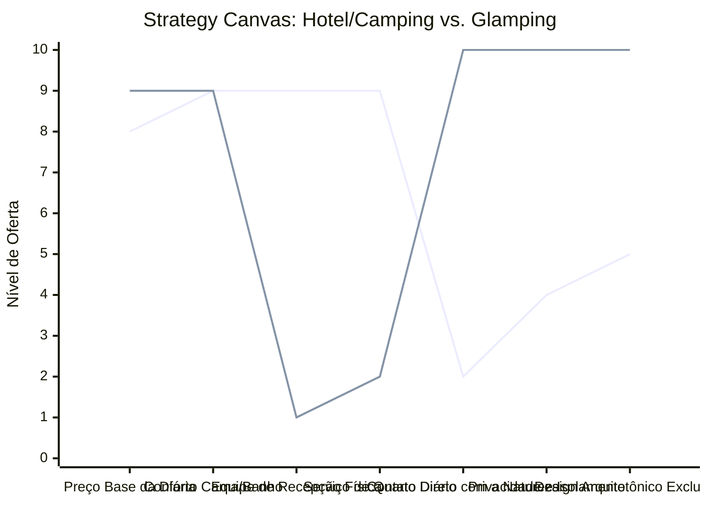

# Estudo de Caso Blue Ocean: Pousadas e Campings

## De "Hospedagem Tradicional" para "Glamping de Experiência e Conexão na Natureza"

### 1. O Cenário Atual (Oceano Vermelho)

O mercado de hospedagem para turismo de natureza e lazer divide-se em duas categorias altamente concorrenciais e com margens severamente espremidas:

1. **Hospedagem Convencional (Pousadas/Hotéis):** Disputa acirrada de preços em plataformas como Booking/Airbnb, gerando altos custos operacionais fixos com equipes presenciais completas (recepção, manutenção, serviço de quarto) e áreas comuns superlotadas e sem privacidade.
2. **Campings Tradicionais:** Competição focada em preços baixíssimos, com apelo restrito a um nicho específico devido à falta de conforto básico (colchões infláveis, banheiros compartilhados precários e exposição extrema a intempéries).
3. **Comoditização Geográfica:** Negócios que dependem puramente da "proximidade de pontos turísticos famosos" para sobreviverem, sofrendo com forte sazonalidade nos meses de baixa temporada.

### 2. A Estratégia do Oceano Azul: "Glamping e Refúgio"

A estratégia propõe a criação de um novo espaço de mercado unindo a total imersão e o isolamento na natureza do camping com o conforto sofisticado de uma hotelaria de charme ou pousada boutique. O foco passa a ser a própria cabana/domo como o destino principal do viajante.

**A Nova Proposta de Valor:**

- **Foco:** Casais urbanos e profissionais estressados que buscam desconexão, privacidade absoluta, silêncio e contato com a natureza, sem abrir mão do conforto de uma cama premium e um banheiro privativo aquecido.
- **Ambiente:** Arquitetura altamente imersiva e icônica (domos geodésicos de vidro, cabanas rústicas de design, A-frames) situadas em pontos estratégicos e isolados de florestas ou montanhas.
- **Modelo de Negócio:** Alto valor de diária combinado com custos fixos mínimos de operação presencial, priorizando o autoatendimento premium digital com alto ticket médio.

### 3. Strategy Canvas (Tela Estratégica)

O gráfico compara as ofertas hoteleiras convencionais com o novo modelo de Glamping, demonstrando o redirecionamento de investimentos da operação presencial burocrática para a qualidade física e de design da estadia.

**Legenda:**

- **Linha 1:** Hotel/Pousada Tradicional
- **Linha 2:** Glamping / Refúgios Exclusivos (Blue Ocean)

> **Nota:** O Glamping diminui drasticamente a dependência de Staff e Serviço de Quarto presencial, focando toda a experiência na Natureza, Privacidade e Design, o que justifica manter o Preço Base elevado.

### 4. Framework das Quatro Ações (ERRC Grid)

| Ação         | O que fazer                                                                                                                                                                                                                                              |
| :----------- | :------------------------------------------------------------------------------------------------------------------------------------------------------------------------------------------------------------------------------------------------------- |
| **ELIMINAR** | **Recepção física presencial:** Substituir por check-in/check-out 100% digital via smart locks e guias de acesso interativos. **Serviço de quarto diário intrusivo:** Garantir a privacidade total e isolamento absoluto do hóspede.                  |
| **REDUZIR**  | **Custos com staff fixo local:** Minimizar a folha de pagamento ao focar no autoatendimento premium inteligente. **Áreas compartilhadas tradicionais:** Eliminar piscinas ou salões coletivos barulhentos para focar no silêncio.                     |
| **AUMENTAR** | **Conectividade de Alta Qualidade:** Internet veloz via satélite (Starlink) para permitir "anywhere office". **Conforto no isolamento:** Enxovais de algodão egípcio, lareira ecológica, cafeteiras premium e aquecimento de piso.                   |
| **CRIAR**    | **Kits de Auto-serviço Gourmet:** Cestas de café da manhã pré-montadas de produtores locais, kits de marshmallows e tábuas de queijos/vinhos. **Arquitetura 'Instagramável':** Cabanas com paredes de vidro integradas à paisagem e fire pits privativos. |

### 5. Conclusão

Desvincular o negócio da guerra de preços das grandes plataformas de reserva e da concorrência de pousadas de centro urbano. Ao eliminar os pesados custos operacionais fixos com staff presencial, o investimento é direcionado para a infraestrutura física e para o design arquitetônico da cabana. A acomodação se torna a atração principal do passeio, gerando altas taxas de ocupação mesmo fora de temporadas e atraindo um público de alto poder aquisitivo disposto a pagar diárias elevadas pelo luxo da privacidade e do silêncio.

### 6. Veja Também (Outros Estudos de Caso)

- [Clínica de Psicologia](./clinica-de-psicologia.md)
- [Estética Automotiva](./estetica-automotiva.md)
- [Turismo de Compras Têxtil](./turismo-compras-textil.md)
- [Academia de Escalada](./academia-de-escalada.md)
- [Personal Trainer](./personal-trainer.md)
- [Consultoria Empreendedora](./consultoria-empreendedora.md)
- [Agência de Automação de IA](./agencia-de-automacao-ia.md)
- [Micro Mercado Autónomo](./micro-mercado-autonomo.md)
- [BPO Financeiro e Contabilidade Consultiva](./bpo-financeiro-e-contabilidade.md)
- [Agência de Marketing](./agencia-de-marketing.md)
- [Barbearia](./barbearia.md)
- [Clínica de Estética](./clinica-de-estetica.md)
- [Pet Shop](./pet-shop.md)
- [Cafeteria](./cafeteria.md)
- [Oficina Mecânica](./oficina-mecanica.md)
- [Escola de Idiomas](./escola-de-idiomas.md)
- [Startup B2B SaaS](./startup-b2b-saas.md)
- [Food Truck e Comida de Rua](./food-truck.md)
- [Delivery de Comida Saudável](./delivery-de-comida-saudavel.md)
- [Loja de Roupas](./loja-de-roupas.md)
- [Estúdio de Yoga](./estudio-de-yoga.md)
- [Coworking de Nicho](./coworking-de-nicho.md)
- [Imobiliária Consultiva](./imobiliaria-consultiva.md)
