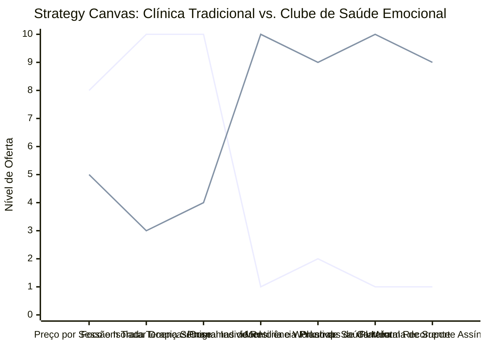

# Estudo de Caso Blue Ocean: Psicologia e Saúde Mental

## De "Terapia Clínica Tradicional" para "Hub de Desenvolvimento Pessoal e Saúde Emocional"

### 1. O Cenário Atual (Oceano Vermelho)

O mercado tradicional de psicologia clínica e de saúde mental é caracterizado por abordagens altamente reativas e estigmatizadas:

1. **Atuação Reativa de Crise:** Clientes só procuram psicólogos quando já estão em nível agudo de sofrimento, burnout ou depressão grave, tratando a psicologia como um remediador de doenças em vez de prevenção.
2. **Modelo de "Venda de Horas" Comercial:** Psicólogos trabalham em consultórios isolados, vendendo sessões individuais de 50 minutos por semana. Se não há consulta presencial, o faturamento do profissional cessa instantaneamente.
3. **Alto Churn e Evasão:** Assim que o cliente supera a fase aguda da crise, ele tende a abandonar a terapia por falta de metas estruturadas, relatórios de evolução palpáveis ou percepção de progresso contínuo.
4. **Benefícios Corporativos Genéricos:** Empresas contratam pacotes básicos de convênios onde a saúde mental se resume a canais telefônicos frios ou palestras institucionais ignoradas pelos colaboradores.

### 2. A Estratégia do Oceano Azul: "Clube de Desenvolvimento Emocional"

A estratégia propõe uma mudança radical: passar do tratamento reativo de patologias para a gestão proativa de inteligência emocional, resiliência no trabalho e desenvolvimento pessoal contínuo de forma híbrida.

**A Nova Proposta de Valor:**

- **Foco:** Profissionais liberais, executivos de alta liderança sob extrema pressão e empresas modernas que buscam manter a produtividade intelectual de suas equipes de forma saudável e preventiva.
- **Ambiente:** Sessões individuais focadas em objetivos integradas a workshops dinâmicos em grupo, mentorias de carreira estruturadas e ferramentas interativas digitais de monitoramento diário de humor.
- **Modelo de Negócio:** Assinatura mensal de desenvolvimento de competências mentais (Clube de Saúde Emocional), desvinculando o psicólogo do papel clássico do analista silencioso de divã para um mentor ativo de saúde mental de alta escala.

### 3. Strategy Canvas (Tela Estratégica)

O gráfico compara o modelo de consultório clínico tradicional com o inovador Clube de Desenvolvimento Emocional e Resiliência.

**Legenda:**

- **Linha 1:** Consultório Clínico Tradicional
- **Linha 2:** Clube de Saúde Emocional (Blue Ocean)

> **Nota:** O Clube de Saúde Emocional reduz a exclusividade de sessões semanais clássicas e foca massivamente em Programas Proativos, Suporte Assíncrono e Planos Recorrentes para oferecer desenvolvimento pessoal real e contínuo.

### 4. Framework das Quatro Ações (ERRC Grid)

| Ação         | O que fazer                                                                                                                                                                                                                                         |
| :----------- | :-------------------------------------------------------------------------------------------------------------------------------------------------------------------------------------------------------------------------------------------------- |
| **ELIMINAR** | **Venda puramente horária de sessões avulsas:** Migração total para programas anuais ou semestrais de resiliência e desenvolvimento. **Estigma da terapia exclusiva para "doentes":** Reposicionar o foco total para o crescimento pessoal.      |
| **REDUZIR**  | **Tempo de silêncio passivo no divã:** Abordagens de terapia cognitivo-comportamentais mais estruturadas, pragmáticas e orientadas por metas tangíveis. **Dependência física de reuniões presenciais repetitivas.**                             |
| **AUMENTAR** | **Acompanhamento Ativo Inter-consultas:** Envio assíncrono de exercícios práticos semanais por aplicativo de mensagens. **Foco em ROI e Saúde Corporativa:** Apresentação de relatórios coletivos anônimos de engajamento mental para o RH.      |
| **CRIAR**    | **Planos de Resiliência Corporativos Premium:** Workshops práticos para gestores enfrentarem crises internas e estresse estrutural. **Plataforma de Ferramentas de Respiração/Foco:** Integração de exercícios diários monitorados pelo mentor. |

### 5. Conclusão

Desmistificar e democratizar a saúde mental, transformando a psicologia em uma mentoria de alta performance emocional. Ao focar em prevenir o burnout nas empresas e treinar a resiliência em profissionais premium antes que as crises ocorram, o terapeuta assume o papel de parceiro de crescimento de longo prazo do cliente. Os planos recorrentes garantem estabilidade de faturamento ao profissional e dão ao cliente um ecossistema completo de autodesenvolvimento prático e mensurável.

### 6. Veja Também (Outros Estudos de Caso)

- [Mentoria Premium e Educação de Elite](./mentoria-premium-e-educacao.md)
- [Personal Trainer](./personal-trainer.md)
- [Fisioterapia de Longevidade e Performance](./fisioterapia-e-longevidade.md)
- [Consultoria Empreendedora](./consultoria-empreendedora.md)
- [Estúdio de Pilates de Nicho](./estudio-de-pilates-de-nicho.md)
- [Estúdio de Yoga](./estudio-de-yoga.md)
- [Agência de Marketing](./agencia-de-marketing.md)
- [Coworking de Nicho](./coworking-de-nicho.md)
