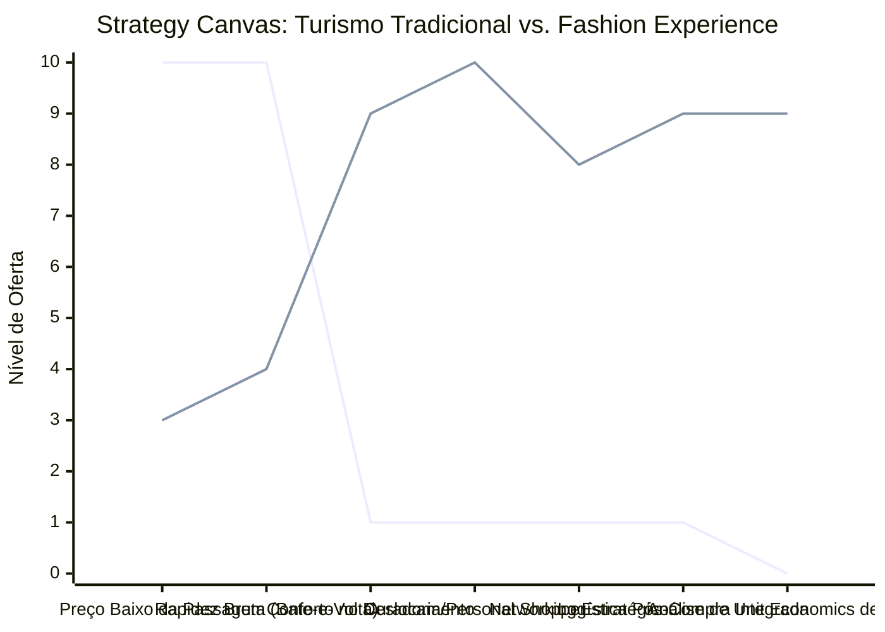

# Estudo de Caso Blue Ocean: Turismo de Compras Têxtil

## De "Sacoleiro" para "Fashion Experience & Curadoria Executiva"

### 1. O Cenário Atual (Oceano Vermelho)

O mercado de turismo de compras têxtil e de confecção tradicional é historicamente focado na redução extrema de custos de transporte e na informalidade logística:

1. **Excursões em Massa ("Bate-e-Volta"):** Viagens noturnas e extremamente cansativas em ônibus lotados de 50 passageiros, sem qualquer conforto ou segurança adequada.
2. **Guerra de Preços no Transporte:** Competição baseada unicamente em oferecer a "passagem mais barata" para cobrir a viagem, levando as empresas de transporte à falência ou à precarização total dos veículos.
3. **Falta de Estrutura e Paradas Comissionadas:** Paradas obrigatórias em locais e lojas de pouca qualidade puramente devido a ganhos comissionados ocultos para o motorista, ignorando as reais necessidades de curadoria do lojista revendedor.
4. **Exaustão Física e Estresse:** O comprador/revendedor assume toda a carga física, carregando fardos pesados de mercadoria em ambientes de alta densidade e desorganizados.

### 2. A Estratégia do Oceano Azul: "Fashion Experience"

Esta estratégia propõe a transição completa do modelo exaustivo de transporte de massa comoditizado (focado apenas no menor preço) para um serviço integrado de alto valor agregado, curadoria de moda de alta conversão e inteligência operacional para o lojista.

**A Nova Proposta de Valor:**

- **Foco:** Lojistas e revendedores de moda premium/boutiques que buscam peças de alta qualidade, alinhadas com as tendências globais de moda, e que se recusam a passar pelo estresse físico e logístico do turismo "sacoleiro".
- **Ambiente:** Viagem em vans ou micro-ônibus executivos de alto padrão, climatizados, equipados com poltronas leito, Wi-Fi de alta velocidade e suporte para carregamento de dispositivos.
- **Modelo de Negócio:** Cobrança por pacote de experiência integrada (transporte premium + assessoria de personal shopper especializada + logística de envio direto para a loja do comprador).

### 3. Strategy Canvas (Tela Estratégica)

O gráfico abaixo ilustra como a estratégia "Fashion Experience" rompe com as métricas tradicionais do setor, eliminando a fadiga física e elevando o suporte logístico e a curadoria estratégica.

**Legenda:**

- **Linha 1:** Turismo de Compras Tradicional (Ônibus de Excursão)
- **Linha 2:** Fashion Experience / Curadoria Executiva (Blue Ocean)

> **Nota:** O modelo "Fashion Experience" reduz drasticamente a relevância do preço baixo da passagem, focando toda a oferta em Conforto, Curadoria Personalizada e Logística Inteligente para garantir que o comprador foque apenas nas vendas e na margem de lucro de sua loja.

### 4. Framework das Quatro Ações (ERRC Grid)

| Ação         | O que fazer                                                                                                                                                                                                                                           |
| :----------- | :---------------------------------------------------------------------------------------------------------------------------------------------------------------------------------------------------------------------------------------------------- |
| **ELIMINAR** | **Viagens noturnas exaustivas:** Acabar com o modelo "bate-e-volta" insalubre e sem descanso. **Lojas comissionadas ruins:** Eliminar paradas em galpões de baixa qualidade focados apenas em propinas ou comissões para motoristas.                 |
| **REDUZIR**  | **Foco exclusivo no preço da passagem:** Abandonar a concorrência pelo bilhete mais barato. **Tamanho dos grupos:** Reduzir de excursões de 50+ pessoas para grupos focados de até 12 empresários em vans executivas.                             |
| **AUMENTAR** | **Conforto e Segurança de Bordo:** Assentos executivos ultra-confortáveis, ambiente climatizado e seguro contra roubos. **Networking:** Promover conexão estruturada entre lojistas para compartilhamento de práticas de vendas durante a viagem. |
| **CRIAR**    | **Serviço de Personal Shopper:** Curadoria especializada para otimizar as compras com base em tendências de mercado. **Logística Integrada de Despacho:** Serviço onde as compras são etiquetadas, embaladas e enviadas diretamente para a loja.  |

### 5. Conclusão

Migrar do transporte físico de massa comoditizado para uma consultoria de compras e facilitação logística. O cliente premium não busca o menor preço de ônibus; ele busca maximizar a margem de vendas de sua loja e manter a sua integridade física. Ao eliminar o estresse logístico e a exaustão das compras em massa, a empresa de turismo têxtil reposiciona-se como um parceiro estratégico de crescimento de lojistas, cobrando tickets expressivamente maiores e operando com margens extremamente saudáveis.

### 6. Veja Também (Outros Estudos de Caso)

- [Clínica de Psicologia](./clinica-de-psicologia.md)
- [Estética Automotiva](./estetica-automotiva.md)
- [Pousadas e Campings](./pousadas-e-campings.md)
- [Academia de Escalada](./academia-de-escalada.md)
- [Personal Trainer](./personal-trainer.md)
- [Consultoria Empreendedora](./consultoria-empreendedora.md)
- [Agência de Automação de IA](./agencia-de-automacao-ia.md)
- [Micro Mercado Autónomo](./micro-mercado-autonomo.md)
- [BPO Financeiro e Contabilidade Consultiva](./bpo-financeiro-e-contabilidade.md)
- [Agência de Marketing](./agencia-de-marketing.md)
- [Barbearia](./barbearia.md)
- [Clínica de Estética](./clinica-de-estetica.md)
- [Pet Shop](./pet-shop.md)
- [Cafeteria](./cafeteria.md)
- [Oficina Mecânica](./oficina-mecanica.md)
- [Escola de Idiomas](./escola-de-idiomas.md)
- [Startup B2B SaaS](./startup-b2b-saas.md)
- [Food Truck e Comida de Rua](./food-truck.md)
- [Delivery de Comida Saudável](./delivery-de-comida-saudavel.md)
- [Loja de Roupas](./loja-de-roupas.md)
- [Estúdio de Yoga](./estudio-de-yoga.md)
- [Coworking de Nicho](./coworking-de-nicho.md)
- [Imobiliária Consultiva](./imobiliaria-consultiva.md)
